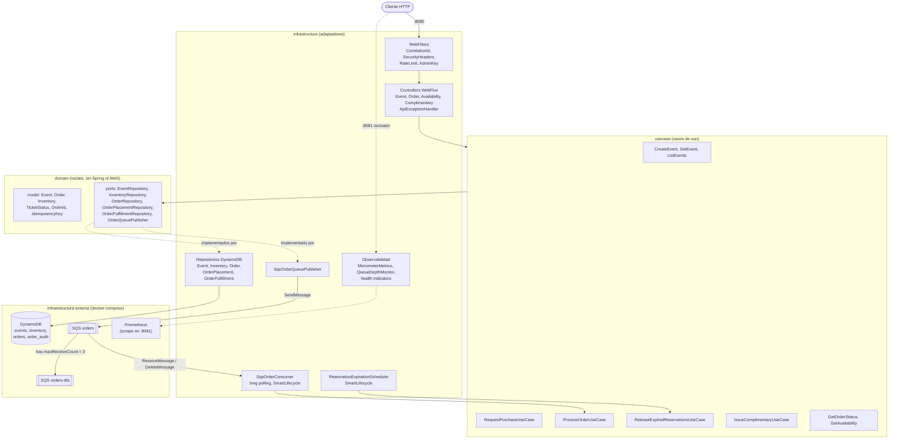
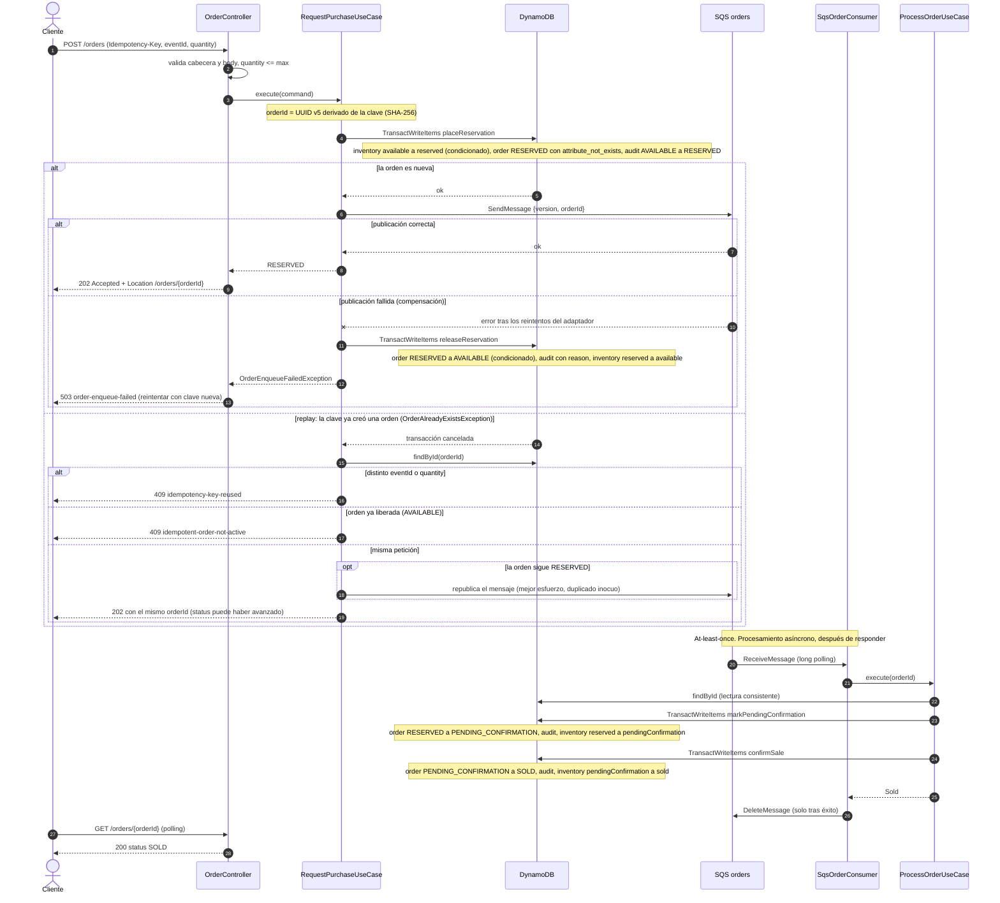
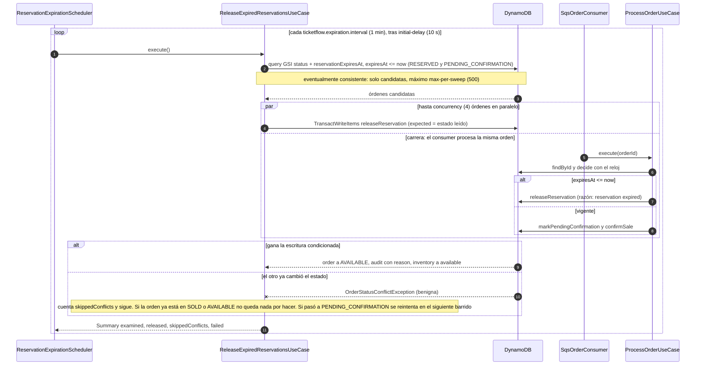
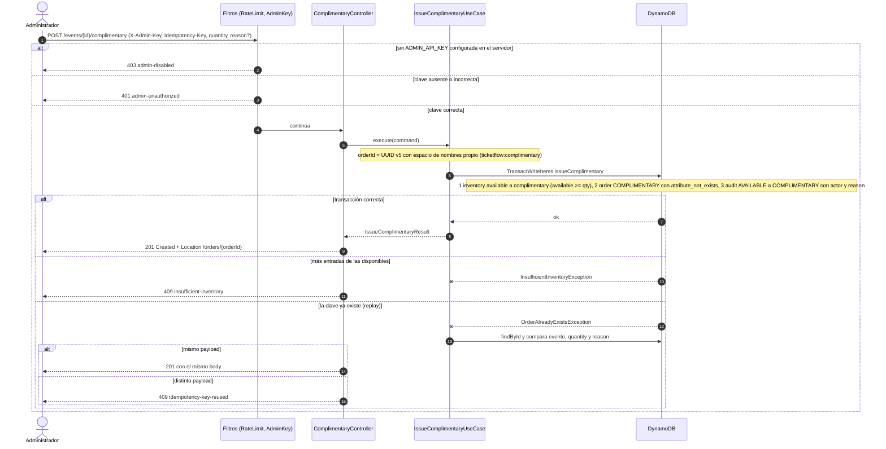
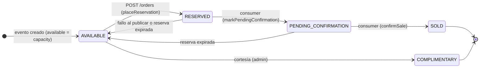
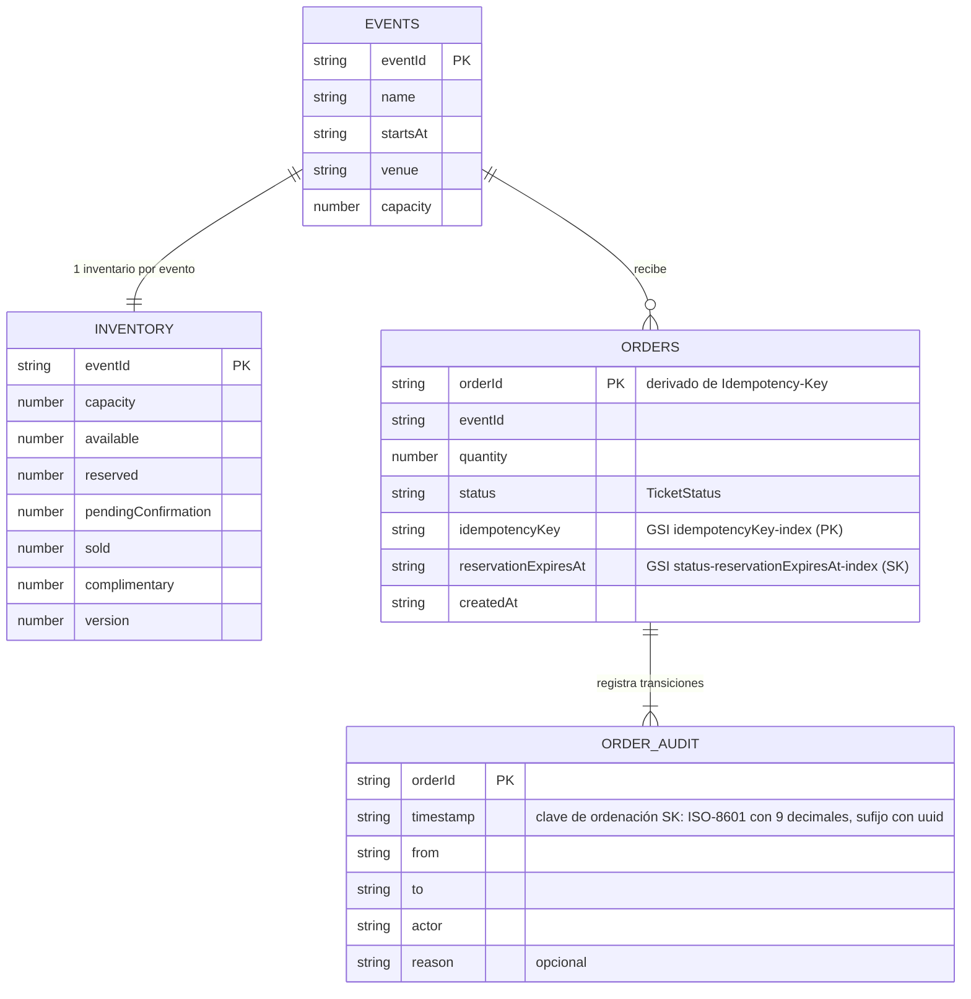

# Arquitectura

Guía de la arquitectura de ticketflow: capas, diagramas (Mermaid, se renderizan en GitHub), modelo de datos y las decisiones de diseño. La visión general y el uso están en el [`README`](../README.md).

Índice: [capas](#capas-clean-architecture) · [componentes](#1-componentes-y-capas) · [compra](#2-flujo-de-compra) · [expiración](#3-expiración-y-carrera-con-el-consumer) · [cortesías](#4-emisión-de-cortesías) · [estados](#5-estados-de-una-entrada) · [modelo de datos](#6-modelo-de-datos-dynamodb) · [reglas e invariantes](#flujo-de-compra-reglas-detalladas) · [SQS y expiración](#mensajería-sqs-y-expiración-detalle) · [decisiones](#decisiones-clave)

## Capas (Clean Architecture)

Paquete raíz: `com.ticketflow`.

```
com.ticketflow
├── domain            # Núcleo: sin Spring, sin AWS (Reactor solo en domain.port)
│   ├── model         # records, enums (TicketStatus), value objects (EventId, OrderId, IdempotencyKey, Quantity...)
│   ├── exception     # errores de dominio
│   └── port          # interfaces de salida (repositories, publisher, IdGenerator) devuelven Mono/Flux
├── usecase           # Casos de uso: orquestan puertos del dominio; BusinessMetrics (puerto de métricas)
└── infrastructure
    ├── web           # Controllers WebFlux, DTOs, mappers, filtros (correlation id, cabeceras, rate limit, admin key)
    │   ├── error     # ApiExceptionHandler (único traductor a problem+json), correlation id
    │   └── ratelimit # token bucket por cliente
    ├── persistence   # Adaptadores DynamoDB (AWS SDK v2 async) y aprovisionamiento de tablas
    ├── messaging     # Adaptadores SQS (publisher y consumer)
    ├── scheduler     # Job de expiración de reservas
    ├── observability # MicrometerMetrics, OperationalMetrics, QueueDepthMonitor, health indicators
    └── config        # @Configuration y @ConfigurationProperties
```

**Regla de dependencias:** `infrastructure → usecase → domain`. Nunca al revés (la comprueba una prueba ArchUnit). `domain` no importa Spring ni AWS SDK. `usecase` solo conoce puertos (`domain.port`) y puede usar `reactor-core` (`Mono`/`Flux`). Los casos de uso son clases sin anotaciones de Spring; sus beans (y `Clock`, `IdGenerator`) se declaran en `infrastructure.config.UseCaseConfig`.

## 1. Componentes y capas



Los tres niveles respetan `infrastructure → usecase → domain`: los controllers, el consumer y el scheduler (adaptadores de entrada) solo invocan casos de uso; los casos de uso solo conocen **puertos** del dominio; los adaptadores de salida (repositorios DynamoDB, publisher SQS) implementan esos puertos (flechas punteadas). Así los casos de uso se prueban con repositorios simulados y los adaptadores contra DynamoDB Local y LocalStack reales.

- **Entrada síncrona**: el cliente llega por el puerto `8080`, pasa por los filtros (en este orden: correlation id, cabeceras de seguridad, rate limit, clave de admin) y por el controller, que valida la forma de la petición y delega en un caso de uso. Todo error se traduce en un único sitio (`ApiExceptionHandler`).
- **Entrada asíncrona**: el consumer SQS y el scheduler son adaptadores de entrada autónomos (`SmartLifecycle`, desactivados por defecto fuera de docker-compose). Ambos mutan el estado de las órdenes con **escrituras condicionadas**, de modo que pueden competir sin coordinación.
- **Salida**: `OrderPlacementRepository` y `OrderFulfillmentRepository` ejecutan cada cambio multi-tabla como un único `TransactWriteItems`; `SqsOrderQueuePublisher` publica el mensaje `{"version":1,"orderId":"..."}`. Los mensajes que SQS no consigue entregar con éxito tras 3 recepciones pasan a la DLQ.
- **Observabilidad**: el puerto de gestión `8081` (aparte del público) sirve las sondas y `/actuator/prometheus`.

## 2. Flujo de compra



1. El controller valida la cabecera `Idempotency-Key` y el body y lanza el caso de uso **desacoplado de la suscripción de la petición** (`Detached`): si el cliente se desconecta, reservar + publicar + compensar terminan igualmente.
2. `placeReservation` es **una sola transacción** con tres ítems: contador de inventario (`available >= qty`, `version + 1`), la orden (`attribute_not_exists(orderId)`) y la auditoría. No existe una ventana con entradas reservadas y sin orden. Como el `orderId` se deriva de la clave, la condición de la orden es lo que garantiza «una orden por clave» incluso con peticiones concurrentes; el replay es simplemente el caso en que esa condición falla.
3. El mensaje se publica **después** de la transacción. Si falla, `releaseReservation` (otra transacción) devuelve el inventario y el cliente recibe `503`; la clave queda consumida (la orden es `AVAILABLE`), por eso debe reintentar con una nueva. Si el proceso muere entre la transacción y la publicación, la orden queda `RESERVED` sin mensaje: un replay la republica y, si nadie reintenta, la libera la expiración.
4. El consumer entrega cada mensaje a `ProcessOrderUseCase`, una máquina de estados idempotente: cada paso es una transacción condicionada al estado esperado. Solo si el caso de uso termina bien se borra el mensaje; si falla, SQS lo reentrega y tras 3 recepciones lo envía a la DLQ.
5. El cliente consulta `GET /orders/{orderId}` hasta ver `SOLD` (o `AVAILABLE` si la reserva expiró y se liberó).

## 3. Expiración y carrera con el consumer



- La consulta al GSI solo **propone candidatas** (es eventualmente consistente); quien decide es la escritura condicionada: `releaseReservation` exige `status = :expected` en la orden, así que para cada orden gana exactamente un actor (el barrido, otro barrido de otra instancia o el consumer).
- El consumer y el barrido usan la **misma frontera** (`expiresAt <= now` es expirada). Una orden expirada que el consumer procesa se libera, nunca se vende; una reserva vigente que el consumer confirma a tiempo no puede liberarla un barrido posterior, porque ya no está en `RESERVED`/`PENDING_CONFIRMATION`.
- Perder la carrera es **benigno**: `OrderStatusConflictException` se cuenta (`skippedConflicts`) y no es un error del barrido. El fallo de una orden no aborta el barrido (`failed`), y un barrido fallido se reintenta en el siguiente intervalo. No hay estados `EXPIRED`/`FAILED`: el motivo vive en la auditoría y la orden vuelve a `AVAILABLE`.
- En una instancia nunca hay dos barridos solapados (el intervalo corre entre el fin de uno y el inicio del siguiente).

## 4. Emisión de cortesías



- La cortesía **no usa la cola ni el barrido**: no hay reserva que expire ni mensaje que procesar. `reservationExpiresAt` es igual a `createdAt` y el estado `COMPLIMENTARY` no figura en el índice de expiración, así que ni el consumer ni el barrido la tocan.
- `COMPLIMENTARY` es final y **no contable como venta**: tiene su propio contador (`complimentary`) en el inventario, independiente de `sold`.
- La autorización la resuelve `AdminKeyWebFilter` **antes** del controller (comparación en tiempo constante). Los intentos fallidos tienen un presupuesto propio de rate limit; la ruta cuenta además contra el presupuesto de escrituras.

## 5. Estados de una entrada



Exactamente las transiciones de `TicketStatus.canTransitionTo` (cualquier otra lanza `InvalidStateTransitionException`, probado con la matriz 5x5):

| Desde | Hacia |
|-------|-------|
| `AVAILABLE` | `RESERVED`, `COMPLIMENTARY` |
| `RESERVED` | `PENDING_CONFIRMATION`, `AVAILABLE` |
| `PENDING_CONFIRMATION` | `SOLD`, `AVAILABLE` |
| `SOLD`, `COMPLIMENTARY` | (ninguna: finales) |

- Una entrada (o, en este modelo, una orden) tiene **un solo estado a la vez**. `SOLD` es final e irreversible; `COMPLIMENTARY` es final pero no contable. Solo `SOLD` es una venta (`isSale`): `RESERVED` y `PENDING_CONFIRMATION` retienen inventario temporalmente.
- Volver a `AVAILABLE` es siempre una **liberación** (`releaseReservation`): ocurre por fallo al publicar (compensación) o por expiración, nunca por una cancelación del usuario. No existen `EXPIRED`/`FAILED`: la razón queda en la auditoría.
- Cada transición deja una entrada en `order_audit` (`from`, `to`, `actor`, `reason?`, marca de tiempo) dentro de la misma transacción que la produce.

## 6. Modelo de datos (DynamoDB)



Índices secundarios globales de `orders` (proyección `ALL`): `idempotencyKey-index` (clave de partición `idempotencyKey`) y `status-reservationExpiresAt-index` (partición `status`, orden `reservationExpiresAt`), este último para el barrido de expiración. Las tablas son `PAY_PER_REQUEST`. Las relaciones del diagrama son lógicas: DynamoDB no tiene claves foráneas; la integridad la mantienen las transacciones.

- `events` e `inventory` se crean juntos al guardar el evento (`EventRepository.save`): `available = capacity`, `version = 0`.
- Los contadores de `inventory` solo se modifican con `UpdateItem`/`TransactWriteItems` y `ConditionExpression` (mecanismo anti-sobreventa), sin lectura-modificación-escritura. Invariante: `available + reserved + pendingConfirmation + sold + complimentary = capacity`.
- La suite de concurrencia reconcilia al final de cada escenario `inventory`, `orders` y `order_audit` leyendo DynamoDB directamente.

## Modelo de datos: reglas detalladas

Inventario por **contadores** por evento (no una fila por asiento): `available`, `reserved`, `pendingConfirmation`, `sold`, `complimentary`, más `version`.

- `events`: PK `eventId`.
- `inventory`: PK `eventId`; los contadores se modifican **solo** con `UpdateItem` + `ConditionExpression` (p. ej. `available >= :qty`), incrementando `version` en la misma escritura atómica; sin lectura-modificación-escritura. Es el mecanismo anti-sobreventa.
- `orders`: PK `orderId`; atributos `eventId`, `quantity`, `status`, `idempotencyKey`, `reservationExpiresAt`, `createdAt`. GSI por `idempotencyKey` y GSI por `status` + `reservationExpiresAt` para el barrido de expiración.
- `order_audit`: PK `orderId`, SK `timestamp`; registro de transiciones (`from`, `to`, `actor` y `reason` opcional). El valor de la SK es `<ISO-8601 con 9 decimales>#<uuid>`: ordena cronológicamente y dos entradas del mismo instante no colisionan. Los timestamps usados como clave (`reservationExpiresAt` en el GSI de expiración) se guardan con ancho fijo (9 decimales) para que el orden lexicográfico coincida con el cronológico.
- Transición de estado de una orden (`OrderRepository.transition`): un único `TransactWriteItems` con `Update` condicionado a `status = :expected` + `Put` de la auditoría; si pierde la carrera falla con `OrderStatusConflictException` (nunca sobrescribe).

## Flujo de compra: reglas detalladas

Complementa los diagramas 2 y 3.

1. `POST /orders` (`RequestPurchaseUseCase`) valida, reserva con expiración a 10 min (`ticketflow.reservation.ttl`, por defecto `PT10M`), encola un mensaje en SQS y responde `202` con `orderId`. Reserva de inventario (`available → reserved`, condicionada, `version + 1`), alta de la orden en `RESERVED` y auditoría inicial `AVAILABLE → RESERVED` son **un único `TransactWriteItems`** (`OrderPlacementRepository.placeReservation`). El mensaje se publica después; si falla, `releaseReservation` (otro `TransactWriteItems`: orden `RESERVED → AVAILABLE` condicionada + auditoría con `reason` + inventario `reserved → available`) compensa y el error se propaga (`OrderEnqueueFailedException`). El consumer (F-014) y el barrido (F-017) reutilizan `releaseReservation`.
   - **Idempotencia**: el `orderId` se deriva determinísticamente del `Idempotency-Key` (UUID de nombre, SHA-256), así que `attribute_not_exists(orderId)` garantiza una sola orden por clave incluso con peticiones concurrentes. Misma clave y mismo payload devuelve la orden existente (sin reservar ni publicar de nuevo); misma clave con distinto payload falla con `IdempotencyKeyReusedException`. La clave tiene 16-128 caracteres (validado en la capa web).
   - Recuperación de una reserva sin mensaje (F-023): si el proceso muere o el cliente se desconecta entre la transacción y la publicación, la orden queda `RESERVED` sin mensaje. Un reintento con la misma clave y payload sobre una orden aún `RESERVED` **republica su mensaje** (mejor esfuerzo, sin liberar nada si falla; los duplicados son inocuos porque el consumer es idempotente); si nadie reintenta, la reserva se recupera al expirar (F-017). Además, el controlador desacopla «reservar + publicar + compensar» de la suscripción de la petición (`Detached`), así que una desconexión a mitad de camino no la interrumpe.
   - Clave consumida: si la orden de una clave fue liberada (compensada tras fallar la publicación, o expirada) queda `AVAILABLE`; reintentar con la misma clave y mismo payload lanza `IdempotentOrderNotActiveException` (`409 idempotent-order-not-active`; no reserva ni publica): el cliente debe reintentar con una `Idempotency-Key` nueva. Con distinto payload prevalece `IdempotencyKeyReusedException`.
2. El consumer SQS (at-least-once) invoca `ProcessOrderUseCase` (F-014) con el `orderId`. Es una máquina de estados guiada por el estado actual de la orden (lectura consistente) y **cada paso es idempotente y es un único `TransactWriteItems`** (`OrderFulfillmentRepository`): cambio de estado de la orden condicionado al estado esperado + auditoría + movimiento del contador de inventario (condicionado a `origen >= qty`, `version + 1`).
   - Orden inexistente: `OrderMissing` (sin escrituras). `SOLD`/`COMPLIMENTARY`/`AVAILABLE`: `AlreadyProcessed` (sin escrituras).
   - `RESERVED` vigente: `markPendingConfirmation` (`reserved → pendingConfirmation`) y a continuación `confirmSale` (`pendingConfirmation → sold`) → `Sold`. `PENDING_CONFIRMATION` vigente (p. ej. caída tras el primer paso): solo `confirmSale`.
   - `RESERVED`/`PENDING_CONFIRMATION` con `reservationExpiresAt <= now`: `releaseReservation` (razón `reservation expired`) → `ReleasedAsExpired`; la orden queda `AVAILABLE` (no hay estados EXPIRED/FAILED) y nunca se vende.
   - Concurrencia: con varios workers sobre la misma orden gana exactamente uno por paso (condición de estado); el perdedor recibe `OrderStatusConflictException`, lo trata como benigno releyendo la orden (acotado a 5 lecturas) y termina como `AlreadyProcessed` o ayuda a terminar el paso pendiente. Los errores transitorios de infraestructura se propagan para que SQS reentregue.
3. Los mensajes que fallan (o no se confirman) tras `maxReceiveCount` recepciones (3 en la cola local, `docker/localstack/init-queues.sh`) van a la DLQ `orders-dlq`.
4. El scheduler (`ReservationExpirationScheduler`, F-017; `ticketflow.expiration.*`, desactivado por defecto salvo en docker-compose) ejecuta cada minuto `ReleaseExpiredReservationsUseCase`: consulta el GSI `status` + `reservationExpiresAt` (paginado, eventualmente consistente; solo da candidatas) las órdenes `RESERVED/PENDING_CONFIRMATION` con `expiresAt <= now` (la frontera cuenta como expirada, igual que `ProcessOrderUseCase`) y libera cada una con `releaseReservation` (razón `reservation expired`), devolviéndolas a `available`. Concurrencia y tope por barrido acotados; un conflicto de estado (otro barrido o el consumer ganó) es benigno, y el fallo de una orden no aborta el barrido. Nunca hay dos barridos solapados en una instancia; entre instancias basta la escritura condicionada (un único ganador por orden).

## Mensajería SQS y expiración (detalle)

Detalle de los adaptadores de entrada y salida asíncronos; los diagramas 2 y 3 muestran su interacción.

### Publicación de órdenes (publisher SQS)

Propiedades en el [README](../README.md#referencia-de-configuración). `docker-compose.yml` las fija para LocalStack con credenciales dummy.

- `RequestPurchaseUseCase` publica en la cola con el cliente SQS asíncrono del AWS SDK v2 y solo continúa cuando SQS confirma el mensaje.
- Cuerpo del mensaje: JSON versionado `{"version":1,"orderId":"..."}` (la orden se relee de DynamoDB por id). Atributos de mensaje para trazabilidad: `eventId`, `orderId`, `messageVersion` y, si el contexto de Reactor trae la clave `correlationId`, `correlationId`.
- La URL de la cola se resuelve por nombre en la primera publicación y se cachea (los fallos no se cachean). Si la cola no existe se falla con un error claro (`OrderQueueNotFoundException`) y la compra compensa la reserva.
- Solo se reintentan (con `Retry.backoff`) los errores transitorios: throttling, 5xx y errores de conexión. El resto falla de inmediato.
- Semántica **at-least-once**: un reintento o un ack perdido pueden duplicar el mensaje. Es aceptable: el consumidor (`ProcessOrderUseCase`) es idempotente por orden.

### Consumidor SQS (procesamiento de órdenes)

`SqsOrderConsumer` (`infrastructure.messaging`) hace *long polling* reactivo de la cola de órdenes e invoca `ProcessOrderUseCase` por cada mensaje. Es un `SmartLifecycle`: arranca con la aplicación y se detiene de forma ordenada. **Está desactivado por defecto**: solo arranca con `ticketflow.sqs.consumer.enabled=true` (`docker-compose.yml` lo activa para `app`), así que los contextos y tests sin SQS no hacen polling. Reutiliza el cliente y la resolución de URL de cola de `ticketflow.sqs.*`.

Propiedades `ticketflow.sqs.consumer.*` en el [README](../README.md#referencia-de-configuración).

Semántica **at-least-once**:

- El mensaje se **borra solo después** de que el caso de uso termine con éxito (`Sold`, `ReleasedAsExpired`, `AlreadyProcessed` y `OrderMissing` son resultados terminales).
- Si el caso de uso falla (error transitorio o `OrderStatusConflictException` final), o falla el borrado, el mensaje **no se borra**: SQS lo vuelve a entregar tras el `visibility-timeout` y, superado `maxReceiveCount`, lo mueve a la DLQ. La reentrega es segura porque el caso de uso es idempotente.
- Mensajes *poison* (JSON inválido, `version` desconocida, sin `orderId`): se registran con `WARN` (sin volcar el cuerpo), no se borran y siguen el redrive hacia la DLQ; no detienen el consumidor ni bloquean a los demás mensajes del lote.
- Colas: `docker/localstack/init-queues.sh` crea `orders` con redrive a `orders-dlq` y `maxReceiveCount=3` (configurable con `ORDERS_MAX_RECEIVE_COUNT`). En AWS real hay que crear la cola con una política de redrive equivalente.
- Apagado ordenado: se deja de hacer polling (un long poll en curso se cancela; sus mensajes reaparecen), se espera a los mensajes en vuelo hasta `shutdown-timeout` y después se libera el bucle. Spring espera por defecto 30 s por fase de apagado; mantén `shutdown-timeout` por debajo.
- Inspeccionar la DLQ en local: `docker-compose exec localstack awslocal sqs receive-message --queue-url http://localhost:4566/000000000000/orders-dlq`.

### Liberación automática de reservas expiradas

Una reserva que no se confirma dentro de su plazo (`ticketflow.reservation.ttl`, 10 min) devuelve sus entradas al inventario disponible. `ReservationExpirationScheduler` (`infrastructure.scheduler`) ejecuta periódicamente `ReleaseExpiredReservationsUseCase`, que busca las órdenes `RESERVED`/`PENDING_CONFIRMATION` con `reservationExpiresAt <= ahora` (índice por `status` + `reservationExpiresAt`) y libera **cada una** con `OrderPlacementRepository.releaseReservation`: un único `TransactWriteItems` (orden a `AVAILABLE` condicionada al estado, auditoría con `reason = "reservation expired"` e inventario `reserved`/`pendingConfirmation` → `available`). No existen estados `EXPIRED`/`FAILED`.

**Desactivado por defecto**: solo corre con `ticketflow.expiration.enabled=true` (`docker-compose.yml` lo activa para `app`), así que los contextos y tests sin DynamoDB no lo arrancan. Es un `SmartLifecycle`, igual que el consumidor SQS.

Propiedades `ticketflow.expiration.*` en el [README](../README.md#referencia-de-configuración).

Garantías:

- **Varias instancias / consumidores concurrentes**: la consulta al índice es eventualmente consistente, así que solo da candidatas; la decisión la toma la escritura condicionada. Si dos barridos (o un barrido y `ProcessOrderUseCase`) compiten por la misma orden, gana exactamente uno; el perdedor recibe `OrderStatusConflictException`, que es benigna (se cuenta como `skippedConflicts`, no como error). Una orden que el barrido no ve (recién creada, índice atrasado) se libera en el siguiente.
- **Frontera**: una reserva está expirada cuando `expiresAt <= ahora` (igual en el job y en `ProcessOrderUseCase`).
- **Errores**: el fallo de una orden se registra y se cuenta (`failed`) sin abortar el barrido; el fallo de un barrido completo se registra y el job sigue en el siguiente intervalo.
- Cada barrido registra `examined`, `released`, `skippedConflicts` y `failed`.

## Cortesías (F-021)

`POST /events/{id}/complimentary` (`IssueComplimentaryUseCase`) mueve `AVAILABLE -> COMPLIMENTARY`. Un único `TransactWriteItems` (`OrderPlacementRepository.issueComplimentary`, mismo orden de ítems que `placeReservation`): `[0]` inventario `available -> complimentary` condicionado a `available >= qty` y `version + 1`, `[1]` orden en `COMPLIMENTARY` (`attribute_not_exists(orderId)`), `[2]` auditoría `AVAILABLE -> COMPLIMENTARY` con actor y `reason`. `COMPLIMENTARY` es final y no contable: nada la lleva a `sold` ni la mueve a otro estado (la matriz y `releaseReservation` lo rechazan); sin mensaje en cola; `reservationExpiresAt == createdAt` y el estado no está en el índice de expiración, así que ni el barrido ni `ProcessOrderUseCase` la recogen. Idempotencia con `OrderId.complimentaryFromIdempotencyKey` (espacio de nombres distinto al de las compras). Acceso protegido con `X-Admin-Key` (`AdminKeyWebFilter` + `AdminKeyGuard`, comparación en tiempo constante, deshabilitado por defecto sin `ADMIN_API_KEY`); la autenticación real de usuarios sigue fuera de alcance.

## Endurecimiento de la aplicación (F-023, parte 1)

Detalle y propiedades en [`docs/security.md`](security.md#controles-de-la-aplicación-detalle) y en la [referencia de configuración](../README.md#referencia-de-configuración) del README. Resumen de diseño:

- **Orden de filtros** (`WebFilter`, de fuera a dentro): `CorrelationIdWebFilter` (MIN) -> `SecurityHeadersWebFilter` (+5) -> `RateLimitWebFilter` (+15) -> `AdminKeyWebFilter` (+20). Los errores de los filtros los renderiza `ProblemWebExceptionHandler`, así que un `429` lleva correlation id y cabeceras de seguridad.
- **Rate limiting** (`infrastructure.web.ratelimit`): `TokenBucket` + `ClientRateLimiter` (Caffeine con tamaño máximo y expiración por inactividad, estado por instancia) + `ClientAddressResolver` (socket por defecto; `X-Forwarded-For` solo con `trust-forwarded-for`, última entrada, IP literal validada). Dos limitadores: escrituras por cliente y intentos fallidos de `X-Admin-Key`. Un despliegue real necesita además una capa de borde (F-026).
- **Errores transitorios**: `ApiExceptionHandler` mapea (después de todos los errores de negocio) throttling/5xx de AWS, `SdkClientException`, `TimeoutException`, transacciones en conflicto y `RetryExhaustedException` a `503` + `Retry-After` con texto fijo (`TransientFailures`).
- **Ciclo de vida**: consumer y scheduler capturan un token de generación por arranque en su predicado de repetición.

## Observabilidad (F-024)

Detalle, catálogo de métricas y alertas en [`docs/observability.md`](observability.md). Resumen de diseño:

- **Puertos de métricas**: `usecase.BusinessMetrics` (órdenes colocadas/vendidas/liberadas, rechazos, conflictos) y `infrastructure.observability.OperationalMetrics` (consumer, publisher, barrido, rate limit, 503). Son interfaces sin framework con implementación `NOOP` por defecto (los casos de uso y adaptadores se construyen sin registro en los tests); `MicrometerMetrics` implementa ambas con `MeterRegistry`, registra todas las series al arrancar y solo admite etiquetas de enums fijos (baja cardinalidad). `domain` y `usecase` siguen sin dependencias de Micrometer.
- **Actuator en puerto propio** (`management.server.port`, `8081`), solo `health` (grupos `liveness`/`readiness`, sin detalles), `info` y `prometheus`. `readiness` incluye `DependencyHealthIndicator` para DynamoDB y SQS (reactivos, con timeout y caché breve); `liveness` no depende de nada externo.
- **Profundidad de cola**: `QueueDepthMonitor` (`SmartLifecycle`) sondea `GetQueueAttributes` en segundo plano y publica gauges leídos de memoria.
- **Logs**: JSON ECS de Spring Boot activable por propiedad; el consumer SQS restaura el `correlationId` del atributo del mensaje (validado como en el filtro web) en el contexto Reactor/MDC del mensaje.

## Decisiones clave

- **Optimistic locking / conditional writes** en vez de locks distribuidos: sin coordinación, escala horizontal.
- **Idempotency-Key** en `POST /orders` para soportar reintentos del cliente.
- **Java 25**: records para DTOs, mensajes y value objects; `switch` con pattern matching sobre estados y excepciones (`TicketStatus`, `ProcessOrderUseCase`, `ApiExceptionHandler`); `sealed interface` para los resultados (`ProcessOrderResult`). No se usan virtual threads: el camino es reactivo y no hay código bloqueante que aislar.
- **CD**: imagen publicada en `ghcr.io/alhucave/ticketflow` al crear un tag `v*`.

## Manejo de errores y correlation id (F-020)

- **Un traductor, una forma**: `ApiExceptionHandler.translate(Throwable, correlationId)` convierte cualquier excepción en `ProblemDetail` (`application/problem+json`; `problem(...)` es el único constructor). Lo usan el `@RestControllerAdvice` (errores dentro de controladores) y `ProblemWebExceptionHandler` (`WebExceptionHandler` con orden anterior al `DefaultErrorWebExceptionHandler` de Boot: rutas inexistentes, 405/406/415 de enrutado, excepciones de filtros como el futuro rate limiter), de modo que nunca aparecen la Whitelabel ni `path`/`trace`/`requestId`. Todo lo no mapeado es `500` con texto fijo; el error real se registra con traza.
- **Correlation id**: `CorrelationIdWebFilter` (precedencia máxima) valida/genera el id, lo guarda en el exchange, lo escribe en el contexto Reactor (`correlationId`, que lee `SqsOrderQueuePublisher`) y lo devuelve en la cabecera de toda respuesta.
- **Contexto -> MDC**: `io.micrometer:context-propagation` + `ThreadLocalAccessor` para la clave `correlationId` (MDC de SLF4J) registrado en `ContextRegistry` + `Hooks.enableAutomaticContextPropagation()` (`CorrelationConfig`). Reactor restaura el MDC alrededor de cada señal y lo limpia después, en cualquier hilo, por lo que no se filtra entre peticiones.
- **Reintentos**: solo en adaptadores y para errores transitorios; la capa web comunica `Retry-After` (429, 409 de contención) pero no reintenta.
