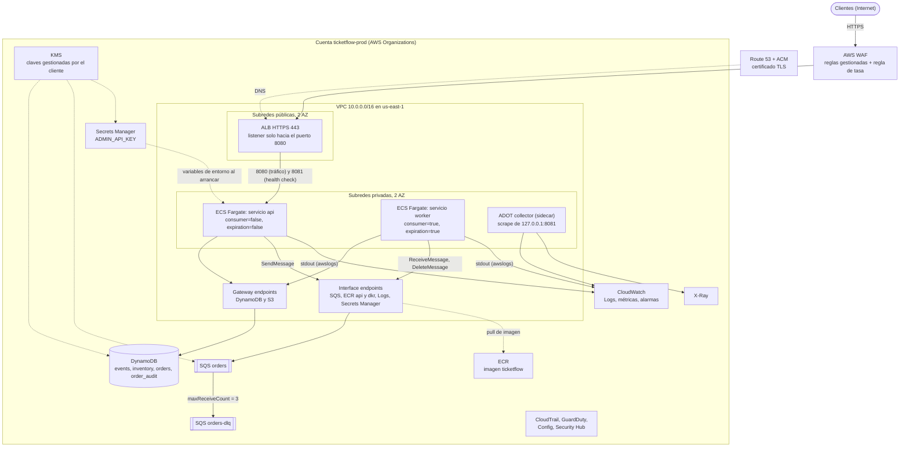
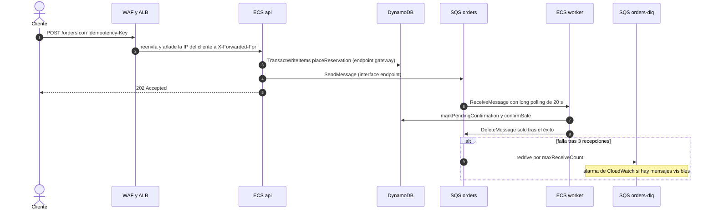
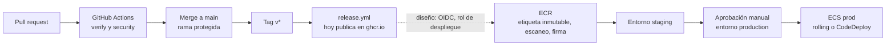

# Despliegue en AWS (diseño)

> **Nada de esto está desplegado en AWS.** ticketflow solo se ha ejecutado en local (DynamoDB Local y LocalStack con `docker-compose`). No se ha creado ninguna cuenta, recurso, red ni credencial de AWS, y el repositorio no contiene Terraform, CDK ni CloudFormation. Este documento es **diseño y estimación**: describe cómo se desplegaría la aplicación **tal como está hoy**, apoyándose en sus propiedades reales, y qué habría que hacer para llegar a producción.
>
> Consecuencias que conviene tener presentes al leerlo:
>
> - **Toda cifra de rendimiento, capacidad o coste es una estimación.** Nada se ha medido en AWS: ni latencias de DynamoDB, ni throughput del consumer, ni comportamiento del autoescalado, ni conflictos de transacciones reales.
> - **Los límites y precios de AWS** llevan su URL y la fecha de consulta (2026-10-03). Lo que no se pudo comprobar se marca como **«to verify»**; los precios cambian y deben reconfirmarse antes de decidir.
> - **Los fragmentos de política IAM, ejemplos de JSON y de configuración** están etiquetados como *ilustrativo, no desplegado*: no se han aplicado a ninguna cuenta.
> - Lo que sí está verificado es lo que dice el código y la configuración del repositorio (propiedades, adaptadores, llamadas al SDK), contrastado contra `src/main`.

## Contenido

1. [Alcance y estado](#1-alcance-y-estado)
2. [Arquitectura objetivo](#2-arquitectura-objetivo)
3. [Cómputo: ECS Fargate](#3-cómputo-ecs-fargate)
4. [Datos y mensajería](#4-datos-y-mensajería)
   - [4.1 DynamoDB](#41-dynamodb)
   - [4.2 Límites de escalabilidad y camino de evolución](#42-límites-de-escalabilidad-y-camino-de-evolución)
   - [4.3 SQS](#43-sqs)
5. [Seguridad en la nube](#5-seguridad-en-la-nube)
   - [5.1 Cuentas](#51-cuentas-y-guardarraíles)
   - [5.2 IAM de mínimo privilegio](#52-iam-de-mínimo-privilegio)
   - [5.3 Credenciales y secretos](#53-credenciales-y-secretos)
   - [5.4 Borde: WAF, rate limit y DDoS](#54-borde-waf-rate-limit-y-ddos)
   - [5.5 Red](#55-red)
   - [5.6 Cifrado](#56-cifrado)
   - [5.7 Cadena de suministro y despliegue con OIDC](#57-cadena-de-suministro-y-despliegue-con-oidc)
   - [5.8 Detección y auditoría](#58-detección-y-auditoría)
   - [5.9 Datos personales, PCI DSS y GDPR](#59-datos-personales-pci-dss-y-gdpr)
6. [Observabilidad en AWS](#6-observabilidad-en-aws)
   - [6.1 Logs](#61-logs)
   - [6.2 Métricas](#62-métricas)
   - [6.3 Trazas](#63-trazas)
   - [6.4 Alarmas](#64-alarmas)
   - [6.5 Dashboards y SLO](#65-dashboards-y-slo)
   - [6.6 Runbooks y guardia](#66-runbooks-y-guardia)
7. [Gobierno y operación](#7-gobierno-y-operación)
8. [Costes](#8-costes)
9. [Preparación para producción](#9-preparación-para-producción)
10. [Conclusiones y fuentes](#10-conclusiones-y-fuentes)

Documentos relacionados: [`README`](../README.md) · [`architecture.md`](architecture.md) · [`security.md`](security.md) · [`observability.md`](observability.md). Aquí no se repite lo que ya está en esos documentos: se enlaza.

## 1. Alcance y estado

### 1.1 Qué existe y qué es solo diseño

| Tema | Estado hoy |
|------|------------|
| API, consumer SQS, job de expiración, DynamoDB, SQS+DLQ, métricas, logs JSON, sondas, rate limit, imagen distroless, CI de verificación y escaneos, publicación en `ghcr.io` | **Implementado y verificado** en el repositorio (ver [`verification.md`](verification.md)) |
| Cuenta AWS, VPC, ECS, ALB, WAF, ECR, Secrets Manager, KMS, CloudWatch, X-Ray/ADOT, alarmas, IaC, despliegue desde GitHub Actions | **Solo diseño** (este documento) |
| Autenticación de usuarios, pasarela de pago, multi-región, prueba de carga en AWS | **No existe** y no se diseña aquí en detalle (ver [§9.2](#92-qué-falta-para-producción)) |

### 1.2 Mapeo del entorno local a AWS

| Local (hoy) | AWS (diseño) | Notas verificadas en el código |
|-------------|--------------|--------------------------------|
| DynamoDB Local (`-inMemory`) | **DynamoDB** on-demand (`PAY_PER_REQUEST`, igual que `DynamoDbTables`) | Las tablas y GSI las crea la app solo con `ticketflow.dynamodb.provisioning-enabled=true` (por defecto `false`); en producción las crea la IaC |
| LocalStack SQS (`orders`, `orders-dlq`, `docker/localstack/init-queues.sh`) | **SQS Standard** + DLQ con *redrive policy* | `init-queues.sh` fija `maxReceiveCount=3` y `VisibilityTimeout=30`; en AWS lo hace la IaC |
| Contenedor `app` (compose, 1 CPU, 512 MB) | **ECS Fargate**: servicio `api` y servicio `worker` con la misma imagen | Un tamaño de 1 vCPU / 512 MB **no existe** en Fargate (ver [§3.3](#33-dimensionamiento)) |
| `ticketflow:local` / `ghcr.io/alhucave/ticketflow` | **ECR** (etiquetas inmutables, escaneo, firma) | `release.yml` publica hoy en `ghcr.io` con `GITHUB_TOKEN` |
| `ADMIN_API_KEY` y demás variables de `environment:` en compose | **Secrets Manager** (secretos) y *task definition* (configuración no secreta) | La app lee `ADMIN_API_KEY` del entorno; una sola clave activa |
| `restart: unless-stopped` | Reinicio de tareas por **ECS** (health check de contenedor) | `-XX:+ExitOnOutOfMemoryError`: el proceso muere y ECS lo reemplaza |
| `HEALTHCHECK` de la imagen (liveness en `8081`) | Health check del contenedor en la *task definition* + health check del **ALB** (readiness) | Ver [§3.4](#34-health-checks) |
| Puerto `8081` en `127.0.0.1` / Prometheus en el host | Puerto de gestión **solo dentro de la VPC**; **ADOT collector** como *sidecar* hacia CloudWatch o AMP | Ver [§6.2](#62-métricas) |
| `docker-compose logs` (JSON ECS) | **CloudWatch Logs** (driver `awslogs`) | El JSON ECS ya trae `correlationId` en cada línea |
| Credenciales ficticias `test`/`test` | **Rol de tarea** y cadena de credenciales por defecto | Las credenciales estáticas solo se usan si **ambas** están definidas ([`security.md`](security.md#controles-de-la-aplicación-detalle)) |
| Sin borde (puertos en loopback) | **ALB + WAF** (+ opcionalmente CloudFront) | Ver [§5.4](#54-borde-waf-rate-limit-y-ddos) |

### 1.3 Cómo leer los números

- **Fuente de un límite o precio de AWS**: la URL oficial y «consultado el 2026-10-03». Los precios salen del **AWS Price List API** público (ver [§8](#8-costes)), región `us-east-1`.
- **Supuesto**: un número que elijo yo (tamaño de ítem, latencia por transacción, líneas de log por orden). Se declara como supuesto y se parametriza para poder rehacer la cuenta.
- **«to verify»**: no pude comprobarlo contra la documentación; no lo doy por cierto.

## 2. Arquitectura objetivo

### 2.1 Topología



### 2.2 Cómo interactúan las piezas

- **Entrada**: el cliente resuelve el dominio (Route 53), llega por HTTPS al **WAF** asociado al **ALB** (TLS terminado en el ALB con un certificado de ACM; la app habla HTTP plano en `8080`, por eso no envía `Strict-Transport-Security`, ver [`security.md`](security.md#cabeceras-de-seguridad-y-secretos)). El ALB reenvía **solo** el puerto `8080` de las tareas `api`.
- **Compra síncrona** (`POST /orders`): la tarea `api` ejecuta la transacción de reserva en DynamoDB y publica el mensaje en SQS; responde `202`. Ambas llamadas salen por **endpoints de VPC** (DynamoDB por *gateway endpoint*, SQS por *interface endpoint*): el tráfico hacia servicios AWS no necesita NAT ni sale a Internet.
- **Procesamiento asíncrono**: las tareas `worker` hacen *long polling* de la cola, procesan con `ProcessOrderUseCase` y borran el mensaje solo si terminan bien. Tras 3 recepciones fallidas SQS mueve el mensaje a `orders-dlq`, que dispara una alarma ([§6.4](#64-alarmas)). Las mismas tareas `worker` ejecutan el barrido de expiración.
- **Arranque**: ECS (con el *rol de ejecución*, no el de la app) descarga la imagen de ECR y resuelve `ADMIN_API_KEY` en Secrets Manager antes de iniciar el contenedor; la app nunca ve credenciales de larga duración.
- **Observabilidad**: stdout de cada tarea va a CloudWatch Logs; el *sidecar* ADOT lee `127.0.0.1:8081/actuator/prometheus` (misma red de la tarea con `awsvpc`) y publica métricas; las métricas nativas de ALB, SQS y DynamoDB llegan sin configuración.
- **Cuenta**: CloudTrail, GuardDuty, Config y Security Hub vigilan la cuenta de forma transversal ([§5.8](#58-detección-y-auditoría)).

### 2.3 Flujo de una compra en AWS



El detalle de estados, compensaciones y reintentos está en [`architecture.md`](architecture.md#2-flujo-de-compra); aquí solo se muestra por dónde pasa cada llamada en AWS.

### 2.4 Borde: ALB, WAF, CloudFront y API Gateway

| Opción | Cuándo | Pros | Contras con ESTA app |
|--------|--------|------|----------------------|
| **ALB + WAF** (recomendada) | Punto de partida | Sencillo; el ALB añade la IP real a `X-Forwarded-For` y el limitador de la app puede usarla ([§5.4](#54-borde-waf-rate-limit-y-ddos)); el stream SSE funciona sin adaptaciones | El borde está en una región; el DDoS volumétrico lo absorbe Shield Standard + capacidad del ALB |
| ALB + WAF + **CloudFront** | Cuando haya tráfico de lectura global o DDoS serio | Caché de lecturas (`/events`, disponibilidad, si se acepta cierta obsolescencia), absorción en el borde | Con CloudFront delante, la **última** entrada de `X-Forwarded-For` es la IP del nodo de CloudFront, no la del cliente: con `trust-forwarded-for` todos los clientes compartirían bucket por nodo. Habría que mantener el limitador de la app **desactivado para identidad** y limitar solo en WAF. El SSE exige no cachear y timeouts largos |
| **API Gateway** (REST/HTTP) | Solo si se necesitan *usage plans*, claves de API o autorizadores gestionados | Throttling por clave/etapa, integración con Cognito/JWT | El stream SSE no encaja bien (límites de duración de integración, **to verify**); añade coste por petición y otro salto; las rutas son pocas y la app ya valida |

Decisión de diseño: **ALB + WAF** ahora, CloudFront cuando haya una razón medida. La autenticación de usuarios (inexistente hoy) cambiaría el cálculo hacia API Gateway/Cognito o un autorizador en el ALB.

## 3. Cómputo: ECS Fargate

### 3.1 Dos servicios, una imagen

La app se arranca con la **misma imagen** y se especializa con propiedades (verificadas en `application.yml`, `SqsConsumerConfig`, `ExpirationSchedulerConfig`):

| Propiedad (variable) | Por defecto | Servicio `api` | Servicio `worker` |
|----------------------|-------------|----------------|-------------------|
| `ticketflow.sqs.consumer.enabled` (`TICKETFLOW_SQS_CONSUMER_ENABLED`) | `false` | `false` | `true` |
| `ticketflow.expiration.enabled` (`TICKETFLOW_EXPIRATION_ENABLED`) | `false` | `false` | `true` |
| `ticketflow.dynamodb.provisioning-enabled` (`TICKETFLOW_DYNAMODB_PROVISIONING_ENABLED`) | `false` | `false` | `false` |
| `ticketflow.rate-limit.trust-forwarded-for` (`TICKETFLOW_RATE_LIMIT_TRUST_FORWARDED_FOR`) | `false` | `true` (con ALB directo, ver [§5.4](#54-borde-waf-rate-limit-y-ddos)) | no aplica (no recibe tráfico público) |
| `ticketflow.observability.queue-metrics.enabled` | `false` | `false` | `false` salvo que se quiera el gauge de la app ([§6.2](#62-métricas)) |
| `TICKETFLOW_ENVIRONMENT` (etiqueta `service.environment` de los logs) | `local` | `prod` | `prod` |
| `AWS_REGION` y `TICKETFLOW_DYNAMODB_REGION` / `TICKETFLOW_SQS_REGION` | `us-east-1` | región real | región real |

Detalles que importan y que son fáciles de olvidar:

- **No se definen `endpoint`, `access-key-id` ni `secret-access-key`** en AWS: sin endpoint se usa el real y sin ambas claves aplica la cadena de credenciales por defecto (rol de la tarea). Las variables `AWS_ENDPOINT_URL_*` de compose no deben copiarse.
- **La región se lee de `ticketflow.dynamodb.region` y `ticketflow.sqs.region`** (por defecto `us-east-1`), no de `AWS_REGION`: fuera de `us-east-1` hay que fijar las dos propiedades.
- **Los nombres de las tablas están fijos en el código** (`events`, `inventory`, `orders`, `order_audit` en `DynamoDbTables`; no hay prefijo configurable). Dos entornos en la misma cuenta y región colisionarían: es una razón más para una **cuenta por entorno** ([§5.1](#51-cuentas-y-guardarraíles)). El nombre de la cola sí es configurable (`ORDERS_QUEUE_NAME`), y `ticketflow.sqs.orders-queue-url` permite fijar la URL y evitar `GetQueueUrl`.
- **El servicio `api` sigue necesitando SQS** (publica) y el cliente DynamoDB; solo se desactivan los adaptadores de entrada asíncronos.
- Si el servicio `api` arrancara con el consumer activo también funcionaría (es seguro, ver §3.2), pero mezclaría la carga HTTP con la de proceso y complicaría el autoescalado: por eso se separan.
- **El barrido de expiración corre en cada tarea `worker`**: es seguro y se reparte por conflictos benignos, pero con N tareas los N barridos examinan las mismas candidatas (`skippedConflicts` sube y se gastan lecturas y escrituras). Con 2-3 tareas es aceptable; si crece, el paso siguiente es un servicio `expirer` aparte con 1-2 tareas (misma imagen, solo `expiration.enabled=true`).

Variables de entorno de la *task definition* del servicio `api` (ilustrativo, no desplegado; valores de ejemplo):

```json
{
  "environment": [
    { "name": "TICKETFLOW_ENVIRONMENT", "value": "prod" },
    { "name": "AWS_REGION", "value": "us-east-1" },
    { "name": "TICKETFLOW_DYNAMODB_REGION", "value": "us-east-1" },
    { "name": "TICKETFLOW_SQS_REGION", "value": "us-east-1" },
    { "name": "ORDERS_QUEUE_NAME", "value": "orders" },
    { "name": "TICKETFLOW_SQS_CONSUMER_ENABLED", "value": "false" },
    { "name": "TICKETFLOW_EXPIRATION_ENABLED", "value": "false" },
    { "name": "TICKETFLOW_DYNAMODB_PROVISIONING_ENABLED", "value": "false" },
    { "name": "TICKETFLOW_RATE_LIMIT_TRUST_FORWARDED_FOR", "value": "true" }
  ],
  "secrets": [
    { "name": "ADMIN_API_KEY", "valueFrom": "arn:aws:secretsmanager:us-east-1:111122223333:secret:ticketflow/prod/admin-api-key" }
  ]
}
```

### 3.2 Por qué varias instancias son seguras

Verificado en el código y en la suite de concurrencia ([`verification.md`](verification.md#suite-de-concurrencia-de-extremo-a-extremo-f-022)):

- Todo cambio de inventario y de estado es una **escritura condicionada** dentro de un `TransactWriteItems`: gana exactamente una instancia por orden y por paso; la perdedora recibe `OrderStatusConflictException` (benigna).
- El **consumer es idempotente** por orden (máquina de estados guiada por el estado leído con lectura consistente): un mensaje duplicado o reentregado no vende dos veces.
- El **`orderId` es determinista** (UUID de nombre con SHA-256 de la `Idempotency-Key`) y la orden se crea con `attribute_not_exists(orderId)`: dos tareas `api` que reciban la misma clave a la vez producen una sola orden.
- El barrido de expiración y el consumer usan la misma frontera (`expiresAt <= now`) y compiten por escritura condicionada.

Lo que **no** es seguro entre instancias es el estado en memoria: el rate limiter y la caché breve de salud son **por tarea** ([§5.4](#54-borde-waf-rate-limit-y-ddos)).

### 3.3 Dimensionamiento

- En compose la app tiene `mem_limit: 512m`, `cpus: 1.0`, `pids_limit: 200`. **Esa combinación no es válida en Fargate**: con 1 vCPU la memoria mínima es 2 GB (fuente: <https://docs.aws.amazon.com/AmazonECS/latest/developerguide/task_definition_parameters.html>, consultado el 2026-10-03: `512 (.5 vCPU)` admite 1-4 GB y `1024 (1 vCPU)` admite 2-8 GB).
- Propuesta de partida (**supuesto, a validar con una prueba de carga que no existe**): **0,5 vCPU y 1 GB** por tarea para `api` y para `worker`. Con `-XX:MaxRAMPercentage=70` el heap sería de ~717 MB (frente a ~358 MB con 512 MB en compose). El *sidecar* ADOT y el sondeo de salud (una segunda JVM con `-Xmx16m`) comparten la memoria de la tarea: hay que reservarles margen en la definición de contenedores.
- Mínimo **2 tareas por servicio**, repartidas en 2 AZ.
- `readonlyRootFilesystem`: la app necesita un `/tmp` escribible; en Fargate se resolvería con un volumen efímero montado en `/tmp` (compose usa `tmpfs`; si Fargate admite `tmpfs` es **to verify**). Quitar capacidades (`cap_drop: ALL` en compose) se expresa con `linuxParameters.capabilities.drop` (**to verify** el soporte exacto en Fargate).
- Graviton (ARM) reduce el precio por vCPU/GB (ver [§8](#8-costes)), pero `release.yml` hoy construye solo para amd64: exigiría una imagen multi-arquitectura (las bases del `Dockerfile` ya son multi-arquitectura por digest de índice) y volver a pasar los escaneos.

### 3.4 Health checks

| Qué | Dónde | Endpoint | Por qué |
|-----|-------|----------|---------|
| Health check del **contenedor** (ECS reinicia la tarea si falla) | `healthCheck` de la *task definition*: el mismo comando Java de la imagen (`-cp /app/healthcheck Healthcheck`) | **liveness** en `8081` | No depende de DynamoDB ni de SQS: una caída de AWS no debe provocar reinicios en cascada ([`observability.md`](observability.md#sondas-de-salud)). Definirlo explícitamente en la *task definition* en lugar de confiar en el `HEALTHCHECK` del `Dockerfile` (**to verify** si ECS lo hereda) |
| Health check del **ALB** (servicio `api`) | Grupo de destino con *override* de puerto a `8081` | **readiness** (`/actuator/health/readiness`) | Una tarea entra en rotación solo cuando DynamoDB y la cola responden; es el criterio que ya describe `observability.md` para el balanceador |

Trade-offs con cifras de AWS: por defecto el ALB consulta cada 30 s, marca sano tras 5 aciertos y no sano tras 2 fallos (fuente: <https://docs.aws.amazon.com/elasticloadbalancing/latest/application/target-group-health-checks.html>, consultado el 2026-10-03). Si **todos** los destinos fallan a la vez en todas las AZ, el ALB **falla en abierto** y envía tráfico a todos (misma fuente): una caída de DynamoDB no dejará el servicio «sin destinos», responderá `503` desde la propia app. Para la propia readiness, `ticketflow.observability.health.timeout` (2 s) y `cache-ttl` (5 s) acotan las llamadas a AWS por tarea. Las tareas `worker` no están detrás del ALB: solo health check de contenedor (liveness). El `DescribeTable` de la sonda *dynamodb* hace falta como permiso IAM aunque el aprovisionamiento esté desactivado ([§5.2](#52-iam-de-mínimo-privilegio)).

### 3.5 Apagado ordenado

Cadena real al parar una tarea (por un despliegue o una reducción de escala): ECS envía **SIGTERM**, la JVM ejecuta el apagado de Spring y, pasado `stopTimeout`, ECS envía **SIGKILL**.

| Elemento | Valor | Fuente |
|----------|-------|--------|
| `stopTimeout` de ECS en Fargate | por defecto 30 s, máximo 120 s | <https://docs.aws.amazon.com/AmazonECS/latest/APIReference/API_ContainerDefinition.html>, consultado el 2026-10-03 |
| `server.shutdown` de Spring Boot 4.1.1 | **graceful** por defecto | Verificado en la clase `ServerProperties` del artefacto `spring-boot-web-server-4.1.1` (la inicialización por defecto es `Shutdown.GRACEFUL`) |
| Espera por fase de apagado de Spring | 30 s por defecto (`spring.lifecycle.timeout-per-shutdown-phase`) | [`architecture.md`](architecture.md#consumidor-sqs-procesamiento-de-órdenes) |
| `ticketflow.sqs.consumer.shutdown-timeout` | `25s` | `SqsConsumerProperties` |
| `ticketflow.expiration.shutdown-timeout` | `PT20S` | `ExpirationProperties` / README |
| Long poll en curso al parar | se cancela; los mensajes que traía reaparecen tras el `visibility-timeout` | `SqsOrderConsumer` |
| Desregistro del ALB | por defecto espera 300 s antes de completar | <https://docs.aws.amazon.com/elasticloadbalancing/latest/application/edit-target-group-attributes.html>, consultado el 2026-10-03 |

Recomendación (configuración, sin cambios de código): `stopTimeout = 60` en `worker`, `SPRING_LIFECYCLE_TIMEOUT_PER_SHUTDOWN_PHASE=45s` y mantener `shutdown-timeout` del consumer (25 s) por debajo; en `api`, `stopTimeout` ≥ 35 s. Bajar el *deregistration delay* del grupo de destino a 30-60 s: 300 s alarga cada despliegue sin necesidad porque las peticiones son cortas (**excepción**: los streams SSE de larga duración se cortan igualmente al parar). Si el kill llega con mensajes en vuelo, no se pierde nada: reaparecen tras 30 s y el consumer es idempotente (coste: latencia, no consistencia). Con **Fargate Spot** el aviso de interrupción es de 2 minutos y llega como SIGTERM (fuente: <https://docs.aws.amazon.com/AmazonECS/latest/developerguide/fargate-capacity-providers.html>, consultado el 2026-10-03).

### 3.6 Autoescalado

| Servicio | Métrica | Política | Notas |
|----------|---------|----------|-------|
| `api` | CPU media de las tareas | *Target tracking* (p. ej. objetivo 60 %, **valor inicial sin medir**) | La app es reactiva: la CPU sube con el número de peticiones, la memoria casi no |
| `api` | `RequestCountPerTarget` del ALB | *Target tracking* | Más cercana a la demanda real que la CPU; ajustar con una prueba de carga |
| `worker` | Mensajes visibles por tarea | *Target tracking* con **métrica matemática**: `ApproximateNumberOfMessagesVisible` (SQS) dividido entre el número de tareas en ejecución | Es el patrón «backlog por instancia» de la guía de SQS (<https://docs.aws.amazon.com/autoscaling/ec2/userguide/as-using-sqs-queue.html>, consultado el 2026-10-03; ahí se indica que la métrica matemática evita publicar una métrica propia). Objetivo = latencia aceptable ÷ tiempo de proceso por mensaje; el tiempo por mensaje **no está medido** |
| `worker` | Alternativa: *step scaling* sobre `ApproximateNumberOfMessagesVisible` y `ApproximateAgeOfOldestMessage` | Escalones por umbral | Más simple de razonar, menos suave |

Límites de lo que el escalado puede dar (verificados en el código): cada tarea `worker` ejecuta **un solo bucle de polling** (un `ReceiveMessage` en vuelo, lote de hasta 10, `concurrency` 4), así que el rendimiento del consumer escala con el número de tareas, no con hilos. Pero el escalado **no mueve** el techo por evento de [§4.2](#42-límites-de-escalabilidad-y-camino-de-evolución): más tareas contra el mismo ítem de inventario solo producen más conflictos.

### 3.7 Despliegues

| Estrategia | Cuándo | Comentario |
|------------|--------|------------|
| **Rolling update de ECS** (partida) | Ahora | Las versiones conviven unos minutos: es seguro porque el formato del mensaje está versionado (`{"version":1,...}`) y los cambios de esquema de DynamoDB se hacen compatibles hacia atrás. Fijar `minimumHealthyPercent=100` y `maximumPercent=200` para no perder capacidad, y habilitar el *circuit breaker* con *rollback* |
| **Blue/green con CodeDeploy** | Cuando se quiera tráfico canario y *rollback* inmediato | Exige dos grupos de destino y un listener de prueba; encarece la complejidad. Aplica al servicio `api`; el `worker` no recibe tráfico del ALB y se despliega en *rolling* |

Detalle importante: cambiar de versión la `ADMIN_API_KEY` o cualquier variable exige un despliegue nuevo (la app lee el entorno al arrancar); durante un *rolling* conviven tareas con claves distintas unos minutos ([§5.3](#53-credenciales-y-secretos)).

### 3.8 JVM en contenedor

Las banderas ya están en el `ENTRYPOINT` de la imagen y valen igual en Fargate: `-XX:MaxRAMPercentage=70` (el heap se calcula del límite de memoria de la tarea), `-XX:+ExitOnOutOfMemoryError` (ECS reemplaza la tarea en lugar de dejarla degradada), `-XX:-UsePerfData`. No se tocan; si la prueba de carga mostrara presión de memoria, el primer ajuste es subir el tamaño de la tarea (no el porcentaje). No hay *virtual threads* ni código bloqueante ([`conventions.md`](conventions.md)).

## 4. Datos y mensajería

### 4.1 DynamoDB

| Decisión | Propuesta | Razón y fuente |
|----------|-----------|----------------|
| Modo de capacidad | **On-demand** (como ya define `DynamoDbTables`) | Tráfico a picos imprevisibles; sin planificar capacidad. Una tabla nueva sostiene hasta 4 000 escrituras/s y 12 000 lecturas/s y se adapta hasta el doble del pico anterior (<https://docs.aws.amazon.com/amazondynamodb/latest/developerguide/on-demand-capacity-mode.html>, consultado el 2026-10-03). **Provisionado + autoescalado** sale más barato con tráfico estable (ver [§8](#8-costes)) pero el autoescalado reacciona con retraso a un pico de venta |
| Recuperación | **PITR** activado (hasta 35 días a granularidad de segundo, <https://docs.aws.amazon.com/amazondynamodb/latest/developerguide/Point-in-time-recovery.html>, consultado el 2026-10-03) + copias de **AWS Backup** | Una restauración crea una **tabla nueva**: hay un procedimiento de cambio de tabla que ensayar ([§7.4](#74-backups-y-recuperación-ante-desastres)); los nombres de tabla están fijos en el código |
| Protección contra borrado | `DeletionProtectionEnabled` en las 4 tablas; política IAM sin `dynamodb:DeleteTable` para los roles de la app | Evita borrados por error de IaC o de operador |
| Cifrado | En reposo siempre; elegir clave: propiedad de AWS (por defecto, sin coste), gestionada por AWS o **gestionada por el cliente** (KMS, con coste y auditoría de uso) (<https://docs.aws.amazon.com/amazondynamodb/latest/developerguide/EncryptionAtRest.html>, consultado el 2026-10-03) | Con clave del cliente: rotación y revocación controladas por nosotros; **to verify** los permisos exactos de KMS que necesita la tarea |
| TTL | **No se usa** (las tablas no tienen atributo TTL) | La expiración de reservas debe **devolver inventario** con una transacción condicionada; un borrado por TTL es asíncrono y sin lógica. Solo serviría para purgar órdenes/auditoría antiguas con una retención definida (decisión de negocio) |
| GSI | `idempotencyKey-index` y `status-reservationExpiresAt-index` en `orders`, proyección `ALL` (como `DynamoDbTables`) | Las lecturas de los GSI son eventualmente consistentes; el barrido solo propone candidatas. Ver riesgo de GSI caliente en [§4.2](#42-límites-de-escalabilidad-y-camino-de-evolución) |
| Tamaño de ítem | Todos los ítems son de unos cientos de bytes (supuesto < 1 KB) | El límite de AWS es 400 KB por ítem (mencionado en <https://docs.aws.amazon.com/amazondynamodb/latest/developerguide/transaction-apis.html>, consultado el 2026-10-03); ni cerca |
| Transacciones | `TransactWriteItems` en cada paso (3 ítems), hasta 100 ítems por transacción y 4 MB (<https://docs.aws.amazon.com/amazondynamodb/latest/APIReference/API_TransactWriteItems.html>, consultado el 2026-10-03) | **Coste 2x**: «DynamoDB realiza dos lecturas o escrituras subyacentes de cada ítem de la transacción: una para preparar y otra para confirmar» (<https://docs.aws.amazon.com/amazondynamodb/latest/developerguide/transaction-apis.html>, consultado el 2026-10-03). Esa capacidad se consume **aunque la transacción falle** |
| Lecturas | `GetItem` con `consistentRead(true)` en eventos, inventario y órdenes | 1 RRU por lectura de hasta 4 KB (el doble que una eventualmente consistente) |
| Esquema en producción | Fijar el esquema en IaC con los mismos nombres, claves y GSI; **`provisioning-enabled=false`** | Si la IaC y `DynamoDbTables` divergen, la sonda *readiness* (`DescribeTable orders`) o las consultas fallan |

El aprovisionamiento por la propia app (`DynamoDbTableProvisioner`: `DescribeTable`, `CreateTable`, `UpdateTable` para añadir GSI) existe para local. En producción la app **no** debe poder crear ni modificar tablas: ni la propiedad activa, ni permisos `CreateTable`/`UpdateTable` en su rol.

### 4.2 Límites de escalabilidad y camino de evolución

**El hecho de diseño**: el inventario de **un evento** es **un único ítem** de la tabla `inventory` (clave `eventId`). Cada compra lo modifica **tres veces**, en tres transacciones distintas (verificado en `DynamoDbOrderPlacementRepository` y `DynamoDbOrderFulfillmentRepository`): `placeReservation` (`available -> reserved`), `markPendingConfirmation` (`reserved -> pendingConfirmation`) y `confirmSale` (`pendingConfirmation -> sold`). Cada transacción tiene 3 ítems: el contador de inventario, la orden y una fila de auditoría. Por tanto un evento muy demandado queda acotado por los límites de **un ítem / una partición** y por los **conflictos de transacciones** sobre ese ítem. Esto no afecta a la corrección (nunca hay sobreventa: lo comprueban las pruebas de concurrencia) sino al **caudal máximo y a la tasa de éxito en ráfagas**; el propio código lo documenta («Scalability note» en `DynamoDbOrderPlacementRepository`).

**Cifras de AWS** (consultadas el 2026-10-03):

- «Cada partición está diseñada para ofrecer como máximo **3 000 unidades de lectura por segundo y 1 000 unidades de escritura por segundo**. Una unidad de escritura es una escritura por segundo de un ítem de hasta 1 KB» (<https://docs.aws.amazon.com/amazondynamodb/latest/developerguide/bp-partition-key-design.html>).
- Una transacción realiza **dos** escrituras subyacentes por ítem (prepare + commit), consumidas aunque falle (<https://docs.aws.amazon.com/amazondynamodb/latest/developerguide/transaction-apis.html>).
- **Conflictos**: se producen cuando «un ítem de un `TransactWriteItems` forma parte de otro `TransactWriteItems` en curso» (y con `PutItem`/`UpdateItem`/`DeleteItem` concurrentes sobre el mismo ítem). La solicitud falla con `TransactionCanceledException` (o `TransactionConflictException` si es una escritura individual), «**los SDK de AWS no reintentan**» y la métrica de CloudWatch `TransactionConflict` se incrementa por cada solicitud a nivel de ítem rechazada (misma URL). Un `GetItem` concurrente con una transacción no entra en conflicto: ambos pueden tener éxito.
- Nota: la propia app **sí** reintenta: hasta 10 veces con *backoff* exponencial con *jitter* de 20 ms a 1 s (`DEFAULT_MAX_RETRIES`, `DEFAULT_MIN_BACKOFF`, `MAX_BACKOFF`) solo ante errores transitorios, y si se agotan el cliente recibe `503` con `Retry-After`.

**Techo teórico por evento caliente** (derivado, **no medido en AWS**):

- Escritura por compra sobre el ítem de inventario: 3 transacciones x 2 WRU (ítem ≤ 1 KB, factor 2x) = **6 WRU por compra**. Límite de partición: 1 000 WRU/s → **≈ 166 compras/s** como cota por *throughput* (en ese caso comparte partición con otros ítems de la misma tabla, que puede bajar la cota; **to verify**).
- Cota por **serialización/conflicto**: las transacciones sobre el mismo ítem no se ejecutan en paralelo útil; si una transacción mantiene el ítem «en curso» un tiempo `L` (**supuesto**), el máximo es `1/L` transacciones/s y `1/(3L)` compras/s:

| `L` (supuesto) | Transacciones/s sobre el ítem | Compras/s por evento | Compras/hora |
|----------------|-------------------------------|----------------------|--------------|
| 10 ms | 100 | ≈ 33 | ≈ 120 000 |
| 20 ms | 50 | ≈ 17 | ≈ 60 000 |
| 50 ms | 20 | ≈ 7 | ≈ 24 000 |

- En estas hipótesis la cota que manda es la de **conflictos**, no los 1 000 WRU/s. Por encima de ese caudal los intentos no ganan: reintentan (hasta 10 veces), consumen capacidad aunque fallen y acaban en `503`. Una venta relámpago (p. ej. decenas de miles de compras en un minuto sobre un solo evento) **excede** este techo. Como referencia, 50 000 compras en una hora son ≈ 14/s: caben con `L` = 20 ms, con poco margen. **Estos valores deben medirse en AWS antes de prometer capacidad**: la latencia real de una transacción de 3 ítems entre tarea y DynamoDB en la misma región no se ha medido.
- **Lecturas del mismo ítem**: el stream SSE de disponibilidad hace un `GetItem` consistente de `inventory` por intervalo (1 s por defecto, `ticketflow.availability.poll-interval`) **por cliente conectado** (README, «Limitaciones conocidas»). Cada lector consume 1 RRU/s del límite de 3 000 RRU/s de esa partición: unos 3 000 espectadores simultáneos de un evento la saturan (cota derivada, **no medida**).
- **GSI de estado**: `status-reservationExpiresAt-index` tiene como clave de partición `status`, con solo 5 valores posibles, y las actualizaciones de la app solo cambian `status` (el ítem **permanece en el índice** con `SOLD`). Las escrituras al GSI se contabilizan aparte, y «si el GSI no tiene capacidad suficiente se limitan las escrituras de la tabla base» (<https://docs.aws.amazon.com/amazondynamodb/latest/developerguide/GSI.html>, consultado el 2026-10-03): un valor de clave de GSI con todo el tráfico (`RESERVED`, `PENDING_CONFIRMATION`, `SOLD`) es un **riesgo de partición caliente del índice** a gran escala. No se ha medido ni es un problema al volumen del escenario de costes; sería el segundo cuello tras el del inventario (mitigación: fragmentar la clave del GSI, p. ej. `status#shard`).

**Opciones de evolución** (ninguna implementada; todas cambian el modelo y exigen pruebas de concurrencia y reconciliación nuevas):

| Opción | Cómo | Gana | Cuesta / riesgos |
|--------|------|------|------------------|
| **Contadores fragmentados** por evento | Repartir `capacity` en K ítems (`eventId#0..K-1`); cada compra elige un fragmento (al azar, reintento en otro si no alcanza) | El techo sube ~K veces (la guía de [fragmentado de escrituras](https://docs.aws.amazon.com/amazondynamodb/latest/developerguide/bp-partition-key-sharding.html) describe el patrón; consultada el 2026-10-03) | Disponibilidad = suma de K ítems (más lecturas); «últimas entradas» repartidas en fragmentos distintos (una compra de 3 con 1+1+1 libres falla aunque haya 3); la orden debe recordar su fragmento para liberar; el invariante y la reconciliación pasan a ser por suma |
| **Serialización por evento con SQS FIFO** (`MessageGroupId = eventId`) | La API solo encola; un único consumidor por grupo reserva en orden | Sin conflictos; orden justo por evento | La reserva deja de ser síncrona (el `202` ya no significa «reservado»; hace falta un nuevo estado o un rechazo asíncrono); el caudal por grupo sigue acotado por `1/L` salvo que se **agrupen** varias órdenes en una sola actualización del contador (hasta 100 ítems por transacción). SQS FIFO: 300 operaciones/s por partición (3 000 mensajes/s con lotes), <https://docs.aws.amazon.com/AWSSimpleQueueService/latest/SQSDeveloperGuide/high-throughput-fifo.html>, consultado el 2026-10-03. Rompe el `orderId` determinista como mecanismo de idempotencia síncrono |
| **Preasignación de bloques** («tokens») | Cada tarea reclama bloques de N entradas del contador central y reparte desde memoria | Quita el ítem del camino caliente | Entradas varadas si una tarea muere (arrendamientos con caducidad), reparto desigual, más complejidad y nuevos estados a auditar |
| **Sala de espera virtual / control de admisión** | Limitar por evento la tasa de admisión (token bucket por `eventId` en el borde: WAF, CloudFront + función de borde o un servicio de cola) | Convierte los fallos por contención en esperas controladas; protege DynamoDB; da justicia | No sube el techo, solo lo respeta; requiere medir el techo real; coste de un componente más |
| **Caché de lecturas de disponibilidad** | Una sola lectura por evento y por tarea con TTL corto (1-2 s) repartida a todos los clientes SSE; o DAX para lecturas **eventualmente consistentes** | Quita casi todas las lecturas del ítem caliente | DAX no cachea lecturas fuertemente consistentes (<https://docs.aws.amazon.com/amazondynamodb/latest/developerguide/DAX.consistency.html>, consultado el 2026-10-03), así que exigiría aceptar lecturas obsoletas; la caché por tarea es un cambio de código |
| **Global tables / multi-región** | Réplicas en otra región | Disponibilidad regional | **Ahora no**: en tablas globales MREC las transacciones solo son atómicas dentro de la región que las ejecuta, las escrituras se concilian por «el último escritor gana» y las MRSC **no admiten transacciones** (<https://docs.aws.amazon.com/amazondynamodb/latest/developerguide/multi-region-strong-consistency-gt.html>, <https://docs.aws.amazon.com/amazondynamodb/latest/developerguide/globaltables_HowItWorks.html>, consultadas el 2026-10-03). Una reserva condicionada en dos regiones a la vez rompería el invariante. Para DR se plantea activo-pasivo con restauración ([§7.4](#74-backups-y-recuperación-ante-desastres)) |

Recomendación: **medir primero** (prueba de carga en una cuenta de pruebas sobre un evento con un solo ítem de inventario, observando `TransactionConflict`, `ThrottledRequests` y la tasa de `503`), poner **control de admisión** como primera defensa y recurrir a **contadores fragmentados** solo si el caudal medido por evento no basta para el negocio.

### 4.3 SQS

| Tema | Decisión | Detalle |
|------|----------|---------|
| Tipo de cola | **Standard** + consumidor idempotente | At-least-once y sin orden estricto, y la app lo tolera: cada paso es idempotente y condicionado al estado esperado. **FIFO** daría orden y deduplicación a cambio de límites de caudal por grupo (300 operaciones/s por partición, 3 000 con lotes); solo compensa si se serializa por evento (ver [§4.2](#42-límites-de-escalabilidad-y-camino-de-evolución)) |
| Visibility timeout | **30 s** (como `init-queues.sh`) | El consumer lo envía en **cada** `ReceiveMessage` (`ticketflow.sqs.consumer.visibility-timeout`, `30s`), que prevalece sobre el de la cola. Debe superar lo que tarda un lote: el bucle espera a que **todo** el lote (hasta 10 mensajes, `concurrency` 4) termine antes de volver a recibir. Si el procesamiento (`ticketflow.consumer.processing.duration`) se acercara a 30 s, subirlo; el tope de SQS es 12 h (validado por la app) |
| Long polling | `wait-time` **20 s** (máximo) | Reduce las respuestas vacías (<https://docs.aws.amazon.com/AWSSimpleQueueService/latest/SQSDeveloperGuide/sqs-short-and-long-polling.html>, consultado el 2026-10-03). Con 1 *poller* por tarea y 20 s, son ≈ 130 000 solicitudes vacías al mes por tarea (coste en [§8](#8-costes)) |
| DLQ | `orders-dlq` con `maxReceiveCount = 3`; **retención de la DLQ 14 días** | En colas estándar el vencimiento de un mensaje se basa en su marca de **encolado original**, que no cambia al moverse a la DLQ (<https://docs.aws.amazon.com/AWSSimpleQueueService/latest/SQSDeveloperGuide/sqs-dead-letter-queues.html>, consultado el 2026-10-03): con retención de 4 días (por defecto) en la DLQ un mensaje puede expirar antes de que alguien lo mire. Máximo de retención: 14 días (<https://docs.aws.amazon.com/AWSSimpleQueueService/latest/SQSDeveloperGuide/quotas-messages.html>, misma fecha) |
| Redrive | Reconducción manual a la cola de origen tras corregir la causa | Procedimiento en [§6.6](#66-runbooks-y-guardia). Seguro porque el consumer es idempotente |
| Alarma | `ApproximateNumberOfMessagesVisible > 0` en la DLQ | [§6.4](#64-alarmas) |
| Cifrado | **SSE-SQS** (gestionado por SQS) o **SSE-KMS** con clave del cliente | Con SSE-KMS el productor necesita `kms:GenerateDataKey` y `kms:Decrypt` y el consumidor `kms:Decrypt`; hay llamadas a KMS cada vez que expira el periodo de reutilización de la clave de datos, y «los productores incurren en el doble de coste que los consumidores» (<https://docs.aws.amazon.com/AWSSimpleQueueService/latest/SQSDeveloperGuide/sqs-key-management.html>, consultado el 2026-10-03) |
| Tamaño de mensaje | Máximo 1 MiB (1 048 576 bytes, <https://docs.aws.amazon.com/AWSSimpleQueueService/latest/SQSDeveloperGuide/quotas-messages.html>) | El cuerpo real es `{"version":1,"orderId":"..."}` (decenas de bytes) más atributos de trazabilidad |
| Retención de la cola principal | 4 días por defecto (máximo 14) | Suficiente: un mensaje no procesado en horas es ya un incidente |
| Coste de sondeo | Ver [§8](#8-costes) | Cada tarea con `queue-metrics` activo hace 2 `GetQueueAttributes` cada 15 s; en AWS se evita y se usan las métricas nativas de SQS |

## 5. Seguridad en la nube

Se construye sobre [`security.md`](security.md) (modelo de amenazas, controles de la app, cadena de suministro, endurecimiento del contenedor): aquí solo se añade lo que depende de una cuenta AWS.

### 5.1 Cuentas y guardarraíles

- **AWS Organizations** con una cuenta por entorno (`ticketflow-dev`, `ticketflow-staging`, `ticketflow-prod`) más cuentas de **seguridad/auditoría** (agregación de CloudTrail, GuardDuty, Security Hub, Config) y de **registro** centralizado. Motivo concreto de este repositorio: los nombres de tabla son fijos ([§3.1](#31-dos-servicios-una-imagen)), así que la separación por cuenta no es solo higiene.
- **AWS Control Tower** (o una *landing zone* equivalente) para crear cuentas con la línea base. **SCP** de organización, por ejemplo denegar desactivar la auditoría (ilustrativo, no desplegado):

```json
{
  "Version": "2012-10-17",
  "Statement": [
    {
      "Sid": "ProtectAuditTrail",
      "Effect": "Deny",
      "Action": [
        "cloudtrail:StopLogging",
        "cloudtrail:DeleteTrail",
        "guardduty:DeleteDetector",
        "config:StopConfigurationRecorder"
      ],
      "Resource": "*"
    },
    {
      "Sid": "DenyUnusedRegions",
      "Effect": "Deny",
      "NotAction": ["iam:*", "organizations:*", "route53:*", "cloudfront:*", "waf:*", "support:*"],
      "Resource": "*",
      "Condition": { "StringNotEquals": { "aws:RequestedRegion": ["us-east-1"] } }
    }
  ]
}
```

- **Sin usuarios IAM de larga duración**: acceso humano por IAM Identity Center con roles de mínimo privilegio y MFA; acceso de máquinas por roles (tarea, OIDC). **Break-glass**: un rol de emergencia por cuenta con MFA, credenciales en una caja fuerte fuera de línea, alarma inmediata a cada uso (CloudTrail + EventBridge) y revisión posterior.

### 5.2 IAM de mínimo privilegio

Cada servicio tiene su **rol de tarea** (permisos de la aplicación) y comparten un **rol de ejecución** (permisos de ECS para arrancar la tarea). Las listas de acciones salen de las llamadas reales del AWS SDK en `src/main` (adaptadores `persistence`, `messaging`, `observability`, `config`):

| Servicio AWS | Llamadas del SDK | Dónde |
|--------------|------------------|-------|
| DynamoDB | `GetItem` (events, inventory, orders), `PutItem`, `UpdateItem`, `Query` (índices de `orders`, `order_audit`), `Scan` (`events`), `TransactWriteItems` (con `Put` y `Update`; autoriza con `PutItem`/`UpdateItem`, ver abajo), `DescribeTable` | Repositorios; sonda de salud (`DescribeTable` sobre `orders`) |
| DynamoDB (solo local/aprovisionamiento) | `CreateTable`, `UpdateTable`, `DescribeTable` | `DynamoDbTableProvisioner`, solo con `ticketflow.dynamodb.provisioning-enabled=true` |
| SQS | `SendMessage` (publisher), `ReceiveMessage` y `DeleteMessage` (consumer), `GetQueueUrl` (resolución por nombre y sonda), `GetQueueAttributes` (sonda con `orders-queue-url` y `QueueDepthMonitor`) | `SqsOrderQueuePublisher`, `SqsOrderConsumer`, `SqsQueueUrlResolver`, `ObservabilityConfig`, `QueueDepthMonitor` |

Los permisos de las operaciones transaccionales se rigen por los de las operaciones subyacentes `PutItem`, `UpdateItem`, `DeleteItem` y `GetItem`; `dynamodb:ConditionCheckItem` solo hace falta para `ConditionCheck` (<https://docs.aws.amazon.com/amazondynamodb/latest/developerguide/transaction-apis-iam.html>, consultado el 2026-10-03). El código solo usa `Put` y `Update` dentro de las transacciones (no `ConditionCheck` ni `Delete`), así que **no** se conceden esas dos acciones. No existe una acción IAM `dynamodb:TransactWriteItems`.

**Rol de tarea `api`** (ilustrativo, no desplegado; `111122223333` es un identificador de cuenta de ejemplo):

```json
{
  "Version": "2012-10-17",
  "Statement": [
    {
      "Sid": "EventsTable",
      "Effect": "Allow",
      "Action": ["dynamodb:GetItem", "dynamodb:PutItem", "dynamodb:Scan"],
      "Resource": "arn:aws:dynamodb:us-east-1:111122223333:table/events"
    },
    {
      "Sid": "InventoryTable",
      "Effect": "Allow",
      "Action": ["dynamodb:GetItem", "dynamodb:PutItem", "dynamodb:UpdateItem"],
      "Resource": "arn:aws:dynamodb:us-east-1:111122223333:table/inventory"
    },
    {
      "Sid": "OrdersTable",
      "Effect": "Allow",
      "Action": ["dynamodb:GetItem", "dynamodb:PutItem", "dynamodb:UpdateItem"],
      "Resource": "arn:aws:dynamodb:us-east-1:111122223333:table/orders"
    },
    {
      "Sid": "OrderAuditTable",
      "Effect": "Allow",
      "Action": ["dynamodb:PutItem", "dynamodb:Query"],
      "Resource": "arn:aws:dynamodb:us-east-1:111122223333:table/order_audit"
    },
    {
      "Sid": "ReadinessProbe",
      "Effect": "Allow",
      "Action": "dynamodb:DescribeTable",
      "Resource": "arn:aws:dynamodb:us-east-1:111122223333:table/orders"
    },
    {
      "Sid": "PublishOrders",
      "Effect": "Allow",
      "Action": ["sqs:SendMessage", "sqs:GetQueueUrl", "sqs:GetQueueAttributes"],
      "Resource": "arn:aws:sqs:us-east-1:111122223333:orders"
    }
  ]
}
```

Notas sobre el rol `api`: `dynamodb:Query` sobre `orders` **no** hace falta (los casos de uso del servicio `api` no consultan los índices de `orders`: `findByIdempotencyKey` existe en el puerto pero ningún caso de uso lo llama; `findExpiredReservations` solo lo usa el barrido) y sí sobre `order_audit` (la repetición de una cortesía lee la pista de auditoría, `IssueComplimentaryUseCase`). `GetQueueAttributes` solo se usa si se define `ticketflow.sqs.orders-queue-url`; sin él basta `GetQueueUrl`. `Scan` y `PutItem` sobre `events` son de `GET /events` y de la creación del evento (la transacción de `EventRepository.save` hace dos `Put`, en `events` e `inventory`).

**Rol de tarea `worker`** (ilustrativo, no desplegado):

```json
{
  "Version": "2012-10-17",
  "Statement": [
    {
      "Sid": "OrdersTableAndExpiryIndex",
      "Effect": "Allow",
      "Action": ["dynamodb:GetItem", "dynamodb:UpdateItem", "dynamodb:Query"],
      "Resource": [
        "arn:aws:dynamodb:us-east-1:111122223333:table/orders",
        "arn:aws:dynamodb:us-east-1:111122223333:table/orders/index/status-reservationExpiresAt-index"
      ]
    },
    {
      "Sid": "InventoryUpdate",
      "Effect": "Allow",
      "Action": "dynamodb:UpdateItem",
      "Resource": "arn:aws:dynamodb:us-east-1:111122223333:table/inventory"
    },
    {
      "Sid": "AuditWrite",
      "Effect": "Allow",
      "Action": "dynamodb:PutItem",
      "Resource": "arn:aws:dynamodb:us-east-1:111122223333:table/order_audit"
    },
    {
      "Sid": "ReadinessProbe",
      "Effect": "Allow",
      "Action": "dynamodb:DescribeTable",
      "Resource": "arn:aws:dynamodb:us-east-1:111122223333:table/orders"
    },
    {
      "Sid": "ConsumeOrders",
      "Effect": "Allow",
      "Action": ["sqs:ReceiveMessage", "sqs:DeleteMessage", "sqs:GetQueueUrl", "sqs:GetQueueAttributes"],
      "Resource": "arn:aws:sqs:us-east-1:111122223333:orders"
    },
    {
      "Sid": "QueueDepthOfDlqOnlyIfQueueMetricsEnabled",
      "Effect": "Allow",
      "Action": ["sqs:GetQueueUrl", "sqs:GetQueueAttributes"],
      "Resource": "arn:aws:sqs:us-east-1:111122223333:orders-dlq"
    }
  ]
}
```

El `worker` usa el índice `status-reservationExpiresAt-index` (consulta del barrido) y no el de `idempotencyKey`. Las acciones sobre un índice se conceden sobre su ARN (`.../index/<nombre>`) además del de la tabla. La última sentencia solo es necesaria con `ticketflow.observability.queue-metrics.enabled=true` (el monitor consulta la DLQ). Si además se usa SSE-KMS en la cola, el rol `api` necesita `kms:GenerateDataKey` y `kms:Decrypt` y el `worker` `kms:Decrypt` sobre la clave ([§4.3](#43-sqs)).

**`CreateTable`, `UpdateTable` y `DeleteTable` no están en ningún rol**: en producción `provisioning-enabled` es `false` y las tablas las gestiona la IaC con otra identidad.

**Rol de ejecución** (ilustrativo, no desplegado; es el que usa ECS para arrancar, no la app):

```json
{
  "Version": "2012-10-17",
  "Statement": [
    {
      "Sid": "EcrAuth",
      "Effect": "Allow",
      "Action": "ecr:GetAuthorizationToken",
      "Resource": "*"
    },
    {
      "Sid": "EcrPull",
      "Effect": "Allow",
      "Action": ["ecr:BatchGetImage", "ecr:GetDownloadUrlForLayer"],
      "Resource": "arn:aws:ecr:us-east-1:111122223333:repository/ticketflow"
    },
    {
      "Sid": "Logs",
      "Effect": "Allow",
      "Action": ["logs:CreateLogStream", "logs:PutLogEvents"],
      "Resource": "arn:aws:logs:us-east-1:111122223333:log-group:/ecs/ticketflow-*:*"
    },
    {
      "Sid": "ReadAdminKey",
      "Effect": "Allow",
      "Action": "secretsmanager:GetSecretValue",
      "Resource": "arn:aws:secretsmanager:us-east-1:111122223333:secret:ticketflow/prod/admin-api-key-*"
    },
    {
      "Sid": "DecryptSecretKey",
      "Effect": "Allow",
      "Action": "kms:Decrypt",
      "Resource": "arn:aws:kms:us-east-1:111122223333:key/11111111-2222-3333-4444-555555555555"
    }
  ]
}
```

Además, ambos roles necesitan una **política de confianza** para `ecs-tasks.amazonaws.com`, y la identidad que despliega solo puede hacer `iam:PassRole` de esos roles ([§5.7](#57-cadena-de-suministro-y-despliegue-con-oidc)). Validaciones recomendadas: **IAM Access Analyzer** (generar políticas desde CloudTrail tras una prueba real y comparar con estas) y una regla de Config que detecte comodines. Estas listas deben contrastarse con una ejecución real en una cuenta de pruebas (no existe): si un adaptador cambia sus llamadas, hay que actualizarlas.

### 5.3 Credenciales y secretos

- **Sin credenciales estáticas**: la app usa `DefaultCredentialsProvider` salvo que estén **ambas** `access-key-id` y `secret-access-key` (solo local); en ECS el SDK obtiene credenciales temporales del rol de la tarea. No definir esas propiedades en AWS; una regla de revisión de la IaC puede rechazar `TICKETFLOW_*_ACCESS_KEY_ID` en una *task definition*.
- **`ADMIN_API_KEY` en Secrets Manager** y inyectada como variable de entorno por ECS con `secrets.valueFrom` (rol de ejecución, no el de la app). El valor no aparece en la definición de la tarea ni en los logs (la app enmascara sus propiedades con secretos). Generarla con alta entropía (p. ej. 32 bytes aleatorios).
- **Rotación**: Secrets Manager puede rotar con una función Lambda. Detalle propio de esta app: lee **una sola clave** al arrancar (`AdminKeyGuard`), así que rotar exige `update-service --force-new-deployment`, y durante el *rolling* conviven tareas con clave vieja y nueva: ventana de minutos en la que un `401` es posible. Para rotar sin ventana habría que aceptar dos claves activas (cambio de código fuera de alcance). Mientras tanto: rotación manual programada y tras cualquier sospecha.
- El coste de un secreto y de sus llamadas está en [§8](#8-costes). No guardar en Secrets Manager nada que sea configuración no secreta.
- **Cuando exista autenticación de usuarios**, la `Idempotency-Key` debería derivarse incluyendo el principal y las cortesías auditarse con su identidad ([`security.md`](security.md#limitaciones-conocidas), limitaciones 4 y 6); aquí queda como brecha ([§9.2](#92-qué-falta-para-producción)).

### 5.4 Borde: WAF, rate limit y DDoS

**Limitación real del limitador de la app** (verificada en `ClientAddressResolver`, `ClientRateLimiter`, `RateLimitProperties`): identifica al cliente por la dirección del socket, el estado vive **en memoria de cada tarea** y con N tareas el presupuesto efectivo es N veces el configurado (20 de ráfaga, 1/s por cliente). Detrás de un ALB, la dirección remota del socket es **la del ALB**: sin tocar nada, todos los clientes compartirían un bucket (o, con varias tareas, uno por nodo del ALB).

**Cómo se usa `ticketflow.rate-limit.trust-forwarded-for`**:

- El ALB, por defecto (`routing.http.xff_header_processing.mode = append`), **añade la IP del cliente al final** de `X-Forwarded-For` (<https://docs.aws.amazon.com/elasticloadbalancing/latest/application/x-forwarded-headers.html>, consultado el 2026-10-03). La app, con `trust-forwarded-for=true`, usa la **última** entrada, que es la que añadió el único proxy de confianza: correcto con **un solo ALB** delante y las tareas accesibles solo desde él (grupo de seguridad, [§5.5](#55-red)). Un cliente no puede falsificarla porque lo que añade el ALB va al final.
- **Con CloudFront delante del ALB** esa última entrada es la IP del nodo de CloudFront: no sirve como identidad. Mantener `trust-forwarded-for=false` o limitar solo en WAF.
- No activar el atributo del ALB que añade el puerto del cliente a `X-Forwarded-For` (`ip:puerto`): la app exige una **IP literal válida** y haría caer al socket (la IP del ALB).
- El limitador de la app sigue siendo **la última línea**, no la única: con IPv6 la identidad es la dirección completa (un prefijo `/64` da identidades prácticamente ilimitadas) y el estado por tarea es expulsable ([`security.md`](security.md#limitaciones-conocidas), limitaciones 1 y 2).

**El control real de borde es AWS WAF** asociado al ALB:

| Regla | Para qué |
|-------|----------|
| Grupos gestionados por AWS (reputación de IP, conjunto común, entradas malformadas conocidas) | Ruido de Internet y ataques de plantilla; **to verify** qué grupos concretos aplicar |
| **Regla basada en tasa** por IP sobre las rutas de escritura (`POST /orders`, `POST /events`, `POST /events/{id}/complimentary`) | Es el límite global y compartido entre tareas que el limitador de la app no puede dar. Opera sobre agregados por criterio, con ventana de evaluación, límite de peticiones y acción configurables (<https://docs.aws.amazon.com/waf/latest/developerguide/waf-rule-statement-type-rate-based.html>, consultado el 2026-10-03; los valores concretos de ventana y mínimos: **to verify** en esa página). Se dimensiona **por encima** del presupuesto de la app, para que WAF frene lo abusivo y la app siga siendo la que da `429` con `Retry-After` a un cliente normal |
| Regla basada en tasa **más estricta** sobre `/events/*/complimentary` y restricción por IP de origen (lista de IP de administración) | Protege la ruta con la clave de admin; frena fuerza bruta antes de la app |
| Límite de tamaño de cuerpo y cabeceras (coherente con 32 KB de la app) | Defensa en profundidad |
| Registro de WAF a CloudWatch Logs o S3 con muestreo/filtrado | Forense; el coste está en [§8](#8-costes) |

- **Shield Standard** se incluye sin coste adicional en todas las cuentas para el ALB y CloudFront (mencionado en la documentación de AWS Shield: **to verify** el alcance exacto); **Shield Advanced** (suscripción y coste fijo mensual **no calculado aquí**) solo si hay riesgo de DDoS que lo justifique, con respuesta del equipo de AWS y protección de costes.
- **IPv6 y retención de inventario** ([`security.md`](security.md#modelo-de-amenazas)): un cliente con muchas IP retiene inventario 10 minutos; la regla de tasa de WAF y el control de admisión por evento ([§4.2](#42-límites-de-escalabilidad-y-camino-de-evolución)) son las mitigaciones; no son perfectas sin identidad de usuario.
- **El puerto `8081` nunca se publica en el listener del ALB** (solo el grupo de destino de `8080`); el health check usa `8081` desde el grupo de seguridad del ALB. El endpoint de Prometheus no tiene autenticación ([`security.md`](security.md#limitaciones-conocidas), limitación 10): la protección es la red.

### 5.5 Red

- **VPC** con subredes **públicas** (solo ALB) y **privadas** (tareas) en al menos 2 AZ. Las tareas no tienen IP pública.
- **Grupos de seguridad**: el del ALB admite 443 desde Internet; el de las tareas admite `8080` y `8081` **solo desde el grupo del ALB** (y nada más); los endpoints de interfaz admiten 443 desde el grupo de las tareas. Saliente de las tareas: 443 hacia los endpoints (prefijo gestionado para DynamoDB/S3).
- **Endpoints de VPC** en lugar de NAT para el tráfico a AWS: **gateway endpoint** de DynamoDB y S3 (sin coste adicional: <https://docs.aws.amazon.com/vpc/latest/privatelink/gateway-endpoints.html>, consultado el 2026-10-03; S3 hace falta para las capas de ECR) y **interface endpoints** de SQS, ECR (`api` y `dkr`), CloudWatch Logs y Secrets Manager (coste fijo por endpoint y hora, [§8](#8-costes)). Trade-off honesto: a este tamaño, 5 endpoints en 2 AZ (≈ 73 USD/mes) cuestan algo más que 2 NAT Gateway (≈ 65,70 USD/mes + 0,045 USD/GB): los endpoints se justifican por **seguridad** (el tráfico no sale a Internet y se puede restringir por política), no por ahorro. Una opción intermedia: endpoints solo de SQS y DynamoDB (los de datos) y NAT para el resto.
- **Políticas de endpoint**: restringir lo que se puede alcanzar desde la VPC. Ejemplo para el endpoint de DynamoDB (ilustrativo, no desplegado):

```json
{
  "Version": "2012-10-17",
  "Statement": [
    {
      "Sid": "OnlyOurTables",
      "Effect": "Allow",
      "Principal": "*",
      "Action": [
        "dynamodb:GetItem",
        "dynamodb:PutItem",
        "dynamodb:UpdateItem",
        "dynamodb:Query",
        "dynamodb:Scan",
        "dynamodb:DescribeTable"
      ],
      "Resource": [
        "arn:aws:dynamodb:us-east-1:111122223333:table/events",
        "arn:aws:dynamodb:us-east-1:111122223333:table/inventory",
        "arn:aws:dynamodb:us-east-1:111122223333:table/orders",
        "arn:aws:dynamodb:us-east-1:111122223333:table/orders/index/*",
        "arn:aws:dynamodb:us-east-1:111122223333:table/order_audit"
      ]
    }
  ]
}
```

- **TLS**: en el borde con ACM; dentro de la VPC el tráfico ALB -> tarea es HTTP plano en `8080` (la imagen no termina TLS). Opción para exigir cifrado en tránsito también ahí: HTTPS hacia el grupo de destino, que exige gestionar certificados en la imagen (cambio de la app fuera de alcance); mientras tanto, el tráfico no sale de subredes privadas. Todas las llamadas a servicios AWS usan TLS por el propio SDK.
- Registros de flujo de VPC (VPC Flow Logs) hacia CloudWatch Logs o S3 para forense.

### 5.6 Cifrado

| Dato | En reposo | En tránsito |
|------|-----------|-------------|
| Tablas DynamoDB | KMS (clave del cliente recomendada para `orders` y `order_audit`) | TLS del SDK / endpoint |
| Colas SQS y DLQ | SSE-SQS o SSE-KMS ([§4.3](#43-sqs)) | TLS |
| Secretos | Secrets Manager con KMS | TLS |
| Logs (CloudWatch Logs) | Cifrado de grupo de logs con KMS | TLS |
| Imágenes (ECR) | Cifrado de repositorio (AES-256 o KMS) | TLS |
| Backups (PITR, AWS Backup) | Heredan la clave | TLS |

Una **clave de KMS por dominio** (datos, mensajería, secretos, logs) con rotación automática anual, política de clave que separe administración y uso, y alarma ante `ScheduleKeyDeletion`. Cada clave del cliente cuesta una cuota mensual ([§8](#8-costes)).

### 5.7 Cadena de suministro y despliegue con OIDC

Lo que **ya existe** y se conserva ([`security.md`](security.md#cadena-de-suministro)): `gradle.lockfile` y Trivy sobre dependencias e imagen, gitleaks sobre el historial, acciones fijadas por SHA, bases del `Dockerfile` por digest, Dependabot, rama `main` protegida con el check `verify` obligatorio.

Lo que habría que **añadir** al pasar a ECR:

- **Etiquetas inmutables** en el repositorio (una versión no se sobrescribe), **escaneo al subir** (ECR) y **Amazon Inspector** para escaneo continuo de imágenes en ECR (complementa el Trivy de CI, que sigue siendo la puerta de entrada).
- **Firma de la imagen** (p. ej. Cosign o AWS Signer) y verificación en el despliegue; el coste de la firma en ECR figura en el Price List ([§8](#8-costes)). **to verify** el flujo exacto y su soporte en ECS.
- **GitHub Actions hacia AWS con OIDC**, sin claves en secretos del repositorio. Hoy `release.yml` solo usa `GITHUB_TOKEN` para `ghcr.io`; el despliegue sería un job nuevo con `permissions: id-token: write` y un **entorno** de GitHub (`production`, con aprobación obligatoria) cuyo `sub` restringe la confianza (<https://docs.github.com/en/actions/how-tos/secure-your-work/security-harden-deployments/oidc-in-aws>, consultado el 2026-10-03: proveedor `https://token.actions.githubusercontent.com`, audiencia `sts.amazonaws.com`, y evaluar la condición `sub` en la política de confianza).

Política de confianza de ejemplo (ilustrativo, no desplegado):

```json
{
  "Version": "2012-10-17",
  "Statement": [
    {
      "Effect": "Allow",
      "Principal": {
        "Federated": "arn:aws:iam::111122223333:oidc-provider/token.actions.githubusercontent.com"
      },
      "Action": "sts:AssumeRoleWithWebIdentity",
      "Condition": {
        "StringEquals": {
          "token.actions.githubusercontent.com:aud": "sts.amazonaws.com",
          "token.actions.githubusercontent.com:sub": "repo:alhucave/ticketflow:environment:production"
        }
      }
    }
  ]
}
```

Permisos del rol de despliegue (ilustrativo, no desplegado): subir la imagen a un repositorio concreto, registrar la definición de tarea, actualizar los servicios y pasar **solo** los roles de ticketflow a ECS:

```json
{
  "Version": "2012-10-17",
  "Statement": [
    {
      "Sid": "EcrAuth",
      "Effect": "Allow",
      "Action": "ecr:GetAuthorizationToken",
      "Resource": "*"
    },
    {
      "Sid": "EcrPush",
      "Effect": "Allow",
      "Action": [
        "ecr:BatchCheckLayerAvailability",
        "ecr:InitiateLayerUpload",
        "ecr:UploadLayerPart",
        "ecr:CompleteLayerUpload",
        "ecr:PutImage"
      ],
      "Resource": "arn:aws:ecr:us-east-1:111122223333:repository/ticketflow"
    },
    {
      "Sid": "EcsDeploy",
      "Effect": "Allow",
      "Action": ["ecs:RegisterTaskDefinition", "ecs:UpdateService", "ecs:DescribeServices"],
      "Resource": "*"
    },
    {
      "Sid": "PassOnlyAppRoles",
      "Effect": "Allow",
      "Action": "iam:PassRole",
      "Resource": [
        "arn:aws:iam::111122223333:role/ticketflow-api-task",
        "arn:aws:iam::111122223333:role/ticketflow-worker-task",
        "arn:aws:iam::111122223333:role/ticketflow-task-execution"
      ],
      "Condition": { "StringEquals": { "iam:PassedToService": "ecs-tasks.amazonaws.com" } }
    }
  ]
}
```



### 5.8 Detección y auditoría

| Servicio | Para qué | Notas |
|----------|----------|-------|
| **CloudTrail** (trail de organización, a S3 de la cuenta de auditoría con validación de integridad) | Quién hizo qué en la API de AWS | El primer trail de eventos de gestión es gratuito (**to verify** el precio actual: no está en los archivos de precios descargados) |
| **GuardDuty** | Detección de amenazas (credenciales comprometidas, comportamiento anómalo) | Coste según volumen; **no calculado aquí** |
| **Security Hub** | Agregación de hallazgos y comprobación de estándares (CIS, AWS Foundational Security Best Practices) | **No calculado aquí** |
| **AWS Config** | Reglas continuas: tablas con PITR y protección de borrado, colas cifradas, grupos de seguridad sin `0.0.0.0/0` hacia las tareas, repositorios ECR con escaneo, roles sin comodines; *conformance packs* | Coste por elemento y evaluación: **no calculado aquí** |
| **Inspector** | Vulnerabilidades en imágenes de ECR | Complementa Trivy en CI |
| Alarmas de seguridad (EventBridge/CloudWatch) | Uso del rol break-glass, cambios de política IAM, `ScheduleKeyDeletion`, desactivación de GuardDuty/CloudTrail | Notificación a la guardia ([§6.6](#66-runbooks-y-guardia)) |

### 5.9 Datos personales, PCI DSS y GDPR

- **Hoy no se tratan datos personales**: la orden contiene `eventId`, `quantity`, `status`, `idempotencyKey` y marcas de tiempo; no hay nombre, correo, teléfono ni medio de pago; las direcciones IP no se persisten y los logs no registran datos personales ([`conventions.md`](conventions.md), [`observability.md`](observability.md#formato)). La `Idempotency-Key` la elige el cliente: se documenta que no debe contener datos personales.
- **PCI DSS y GDPR están fuera de alcance** de este diseño. Lo que **cambiaría** si se añade un cobro o una cuenta de usuario:
  - **Pago** (`PENDING_CONFIRMATION` es el punto de integración): delegar la captura en un proveedor certificado para que el número de tarjeta **nunca** toque la plataforma (reduce el alcance PCI a SAQ A o similar; **to verify** con un QSA); tokens en lugar de PAN; registro estricto de que ningún log lo contenga.
  - **Datos de usuario**: base legal y minimización, mapa de datos, cifrado con claves del cliente, derecho de acceso y supresión (la `order_audit` pasaría a contener identidad: habría que decidir pseudonimizar o purgar), retención y residencia de datos (una sola región simplifica), encargados de tratamiento y registro de actividades, notificación de brechas.
  - **Auditoría**: el actor fijo `complimentary-issuance` pasa a ser la identidad real (ver [`security.md`](security.md#limitaciones-conocidas)).
- Clasificación sugerida: *Interno* (inventario, órdenes, auditoría), *Confidencial* (`ADMIN_API_KEY`, claves de KMS), *Público* (catálogo de eventos).

## 6. Observabilidad en AWS

Qué se mide en la app y cómo (catálogo de métricas, logs, sondas) está en [`observability.md`](observability.md): aquí solo se mapea a servicios AWS.

### 6.1 Logs

- Driver `awslogs` de ECS: stdout de cada contenedor va a un grupo de logs por servicio (`/ecs/ticketflow-api`, `/ecs/ticketflow-worker`), **cada línea es un objeto JSON ECS** (la imagen ya fija `LOGGING_STRUCTURED_FORMAT_CONSOLE=ecs`), con `correlationId` en cada línea.
- **Retención explícita** (7-30 días en producción; no «nunca expira», que es el valor por defecto de CloudWatch Logs: **to verify**) y cifrado con KMS. CloudWatch Logs cobra ingesta y almacenamiento ([§8](#8-costes)); no subir a `DEBUG` en producción ([`observability.md`](observability.md#notas-de-coste-y-operación)).
- **CloudWatch Logs Insights** detecta los campos JSON automáticamente. Seguir una compra por `correlationId` (el mismo identificador que devuelve la API en `X-Correlation-Id`; ilustrativo, no desplegado):

```text
fields @timestamp, log.logger, message
| filter correlationId = "corr-demo-1"
| sort @timestamp asc
| limit 50
```

Tasa de errores del consumer en los últimos 15 min (el mensaje `Request rejected: status=...` y los `WARN` de mensajes *poison* están en `observability.md`):

```text
fields @timestamp, correlationId, message
| filter log.level = "WARN" or log.level = "ERROR"
| stats count() as n by log.logger
| sort n desc
```

- El **`correlationId` no es un identificador de usuario**: es una etiqueta de petición y viaja en el atributo del mensaje SQS (`SqsOrderQueuePublisher.ATTR_CORRELATION_ID`).

### 6.2 Métricas

| Fuente | Cómo llega a CloudWatch | Observaciones |
|--------|-------------------------|---------------|
| ALB, SQS, DynamoDB, ECS | **Nativas** (sin configuración) | `RequestCount`, `HTTPCode_Target_5XX_Count`, `TargetResponseTime`, `ApproximateNumberOfMessagesVisible`, `ApproximateAgeOfOldestMessage`, `ThrottledRequests`, `TransactionConflict`, etc. |
| `ticketflow.*` y JVM (`/actuator/prometheus` en `8081`) | **Sidecar ADOT** que *scrapea* `127.0.0.1:8081` y publica (a) a CloudWatch como métricas EMF, o (b) a **Amazon Managed Service for Prometheus** (AMP) con **Grafana** | La app **no** tiene dependencia de OpenTelemetry ni de CloudWatch a propósito ([`observability.md`](observability.md#trazas)); el sidecar cubre las métricas **sin cambiar la imagen** |

Comparativa:

| | CloudWatch (EMF vía ADOT) | AMP + Grafana gestionado (ADOT remote write) |
|---|---------------------------|---------------------------------------------|
| Modelo de coste | Por **métrica personalizada** y mes ([§8](#8-costes)): importa elegir qué publicar | Por **muestras** ingeridas, almacenadas y consultadas; los precios están en [§8](#8-costes) (Grafana gestionado: **no calculado**) |
| Cardinalidad | Cada combinación de etiquetas es una métrica: las ~50 series de la app más los ~70 buckets del histograma serían ~120 métricas (≈ 36 USD/mes a 0,30 USD): publicar un **subconjunto** curado | Soporta PromQL y las alertas de [`observability.md`](observability.md#alertas-y-slo-sugeridos) casi sin cambios |
| Alarmas | Nativas de CloudWatch (misma consola que ALB/SQS/DynamoDB) | Alertmanager o alertas de Grafana |
| Operación | Menos piezas | Una pieza más (AMP, Grafana, permisos) |

Recomendación: **CloudWatch** para empezar (métricas nativas + un subconjunto curado de unas 20 métricas de la app + alarmas), y AMP/Grafana si el equipo ya trabaja en PromQL o necesita cardinalidad. Ambos requieren el sidecar y permisos de publicación en el rol de tarea (no incluidos en [§5.2](#52-iam-de-mínimo-privilegio): cambian con la elección).

**Gauges de cola de la app** (`ticketflow.queue.messages`): en AWS hay métricas nativas de SQS sin coste de llamadas, y cada réplica con `queue-metrics` activo hace 2 `GetQueueAttributes` cada 15 s (≈ 345 600 solicitudes al mes por réplica, [§8](#8-costes)). Recomendación: **desactivarlo** en AWS y alarmar sobre las métricas nativas; la **edad del mensaje más antiguo** que la app no expone (`observability.md`) sí la publica CloudWatch como `ApproximateAgeOfOldestMessage`.

### 6.3 Trazas

La app no incluye OpenTelemetry (a propósito, por tamaño de imagen y superficie). El `correlationId` ya viaja API -> atributo del mensaje SQS -> consumer -> logs y es el hilo conductor mientras no haya trazado distribuido ([`observability.md`](observability.md#trazas)).

Opciones para trazas (todas **diseño**; ninguna implementada):

- **AWS X-Ray con ADOT**: el *sidecar* recibe OTLP y envía a X-Ray. Pero la app **no emite spans**: haría falta un **agente Java de OpenTelemetry** (`-javaagent`, por `JAVA_TOOL_OPTIONS` o en el `ENTRYPOINT`). Eso implica meter el agente en la imagen (más superficie y tamaño, nueva superficie de escaneo) y es un cambio de imagen fuera del alcance de esta feature. A cambio daría trazas HTTP -> DynamoDB/SQS -> consumer con el mismo `correlationId` como atributo del span.
- **Muestreo**: con 10 millones de peticiones al mes y un 5 % trazado serían 500 000 trazas (coste en [§8](#8-costes)); muestrear siempre las respuestas `5xx` y lentas.
- Hasta entonces, **Logs Insights por `correlationId`** ([§6.1](#61-logs)) resuelve el 90 % de las investigaciones de este sistema.

### 6.4 Alarmas

Sobre las mismas señales que ya describe [`observability.md`](observability.md#alertas-y-slo-sugeridos) en PromQL; los umbrales son **valores iniciales sin medir**, a ajustar con carga real. «Acción» = a quién llega (SNS -> correo/Slack/PagerDuty).

| Alarma | Métrica (fuente) | Umbral | Acción |
|--------|------------------|--------|--------|
| **DLQ con mensajes** (crítica) | `ApproximateNumberOfMessagesVisible` de `orders-dlq` (SQS) | `> 0` durante 1 periodo de 1 min | Página a guardia; runbook de la DLQ ([§6.6](#66-runbooks-y-guardia)) |
| Cola creciendo | `ApproximateNumberOfMessagesVisible` de `orders` | `> 100` durante 5 min (**sin medir**) | Aviso; ¿el `worker` está parado o saturado? Escalar |
| Mensaje antiguo | `ApproximateAgeOfOldestMessage` de `orders` | `> 120 s` durante 5 min (4x el `visibility-timeout`) | Aviso; el consumer no avanza |
| Tasa de 5xx | `HTTPCode_Target_5XX_Count` / `RequestCount` (ALB) | `> 0,1 %` durante 5 min (SLO 99,9 %) | Página |
| Latencia p99 | `TargetResponseTime` p99 (ALB) | `> 0,5 s` durante 5 min (SLO de `POST /orders`) | Aviso |
| Fallos de readiness | `UnHealthyHostCount` del grupo de destino (ALB) | `>= 1` durante 3 min | Aviso; página si es el 100 % |
| Throttling de DynamoDB | `ThrottledRequests` / errores de `ReadThrottleEvents` y `WriteThrottleEvents` (DynamoDB) por tabla | `> 0` sostenido 5 min | Aviso; mirar contención y límites de partición ([§4.2](#42-límites-de-escalabilidad-y-camino-de-evolución)) |
| **Conflictos de transacción** | `TransactionConflict` (DynamoDB) | Tasa que supere un % del tráfico de escritura (**sin medir**: calibrar con la prueba de carga) | Aviso; ¿evento caliente?, activar control de admisión |
| Pico de rechazos por rate limit | `ticketflow.ratelimit.rejections{limiter="write"}` (app) | `> 10/s` durante 5 min; `limiter="admin_failure"` `> 0` sostenido = fuerza bruta | Aviso; mirar WAF |
| Reinicios de contenedores | Eventos de parada de tareas / `RunningTaskCount` por debajo del deseado (ECS, Container Insights: **to verify**) | Tareas en ejecución `< deseado` durante 5 min | Aviso; ¿OOM (`ExitOnOutOfMemoryError`)? |
| **Invariante de inventario roto** (crítica) | `ticketflow.conflicts{type="inventory_insufficient",operation="process_order"}` (app) | `> 0` en 5 min (debe ser siempre 0) | Página; detener ventas, ejecutar la reconciliación ([§6.6](#66-runbooks-y-guardia)) |
| Barrido de expiración sin avanzar | `ticketflow.expiration.sweeps{result="ok"}` (app) | `increase == 0` en 10 min (si el job está activo) o `sweep.orders{result="failed"} > 0` | Aviso; las reservas expiradas no se recuperan |
| Fallos del consumer | `ticketflow.consumer.messages{outcome="failed"}` / total (app) | `> 5 %` durante 5 min | Aviso |
| Mensajes *poison* | `ticketflow.consumer.messages{outcome="poison"}` (app) | `> 0` en 10 min | Aviso; alguien publica basura |
| **Reconciliación** (comprobación programada) | Métrica personalizada publicada por un trabajo programado ([§6.6](#66-runbooks-y-guardia)) | `mismatch > 0` | Página |
| Dependencias | `ticketflow.dependency.unavailable` (app) | `increase > 0` en 5 min | Aviso |
| Seguridad / coste | WAF `BlockedRequests` anómalo; Budgets y Cost Anomaly Detection ([§7.1](#71-etiquetado-y-control-de-costes)) | Anomalía / umbral presupuestario | Aviso |

Las alarmas de la app (`ticketflow.*`) solo existen si se publican esas métricas ([§6.2](#62-métricas)): si se elige publicar un subconjunto, **estas** deben estar dentro. Las nativas (SQS, ALB, DynamoDB, ECS) no dependen del sidecar.

### 6.5 Dashboards y SLO

- **Dashboard operativo**: tráfico y 5xx/latencia del ALB; mensajes visibles y edad de la cola y la DLQ; `ticketflow.orders.placed/sold/released`; conflictos y *throttling* de DynamoDB; tareas en ejecución por servicio; rechazos por rate limit.
- **SLO sugeridos** (a validar con medición): disponibilidad de la API 99,9 % (5xx sobre total); latencia p99 de `POST /orders` < 500 ms (acepta la compra, no el procesamiento); **tiempo hasta `SOLD`** (de aceptación a venta) p95 < 30 s (la cola hace que no dependa del cliente); **cero** sobreventa y cero órdenes aceptadas perdidas (se comprueba con la reconciliación, no con una métrica de tasa).
- **Error budget**: con 99,9 % al mes son ≈ 43 minutos de indisponibilidad; si se agota, se congelan despliegues no urgentes.

### 6.6 Runbooks y guardia

**Redrive de la DLQ** (mensajes que fallaron `maxReceiveCount` veces):

1. Mirar la alarma y `ticketflow.consumer.messages{outcome}` (¿`failed` o `poison`?) y los logs del `worker` por el `correlationId` del mensaje (los atributos del mensaje lo traen).
2. Identificar la causa: error transitorio ya resuelto (p. ej. un corte de DynamoDB), un bug de la app, o un mensaje inválido (*poison*).
3. Si es transitorio o está corregido: reconducir de la DLQ a la cola `orders` con la función de **redrive** de la consola/API de SQS (**to verify** el nombre exacto de la API vigente). Es seguro por idempotencia del consumer. Vigilar que no vuelvan.
4. Los *poison* no se reconducen: se inspeccionan y se descartan documentando la causa.
5. Recordar la **retención** de la DLQ (14 días recomendados, [§4.3](#43-sqs)).

**Reservas atascadas en `RESERVED`** (más de 10 min, el job no las libera):

1. Comprobar `ticketflow.expiration.sweeps`: ¿el `worker` está arriba y el job activo (`TICKETFLOW_EXPIRATION_ENABLED=true`)?
2. Comprobar `ticketflow.expiration.sweep.orders{result="failed"}` y los logs por errores de DynamoDB.
3. Una orden `RESERVED` sin mensaje (la tarea murió entre la transacción y el `SendMessage`) se libera al expirar; un reintento del cliente con la misma clave republica el mensaje.
4. Si hay órdenes muy por encima del TTL, mirar `max-per-sweep` (500): una avalancha de expiradas tarda varios barridos en liberarse.

**Reconciliación como trabajo operativo.** La suite de concurrencia ya implementa la comprobación (`Reconciliation`: el invariante `available + reserved + pendingConfirmation + sold + complimentary = capacity`; contadores de `inventory` frente a la suma por estado de `orders`; cadena de auditoría; órdenes no perdidas). Convertirla en **trabajo programado** (p. ej. una tarea ECS efímera lanzada por EventBridge Scheduler cada hora, con rol de **solo lectura** sobre las 4 tablas) que publique una métrica `mismatch` es la señal que cierra el círculo; hoy es **solo diseño** (no existe ese trabajo ni otra forma de ejecutarlo fuera de las pruebas). Como la comprobación lee varias tablas sin instantánea, debe tolerar el tráfico en vuelo (comparar solo eventos sin operaciones en curso o repetir antes de alertar), igual que hace la suite. Para eventos con alto tráfico se debe medir su coste de lectura.

**Guardia (on-call)**: rotación semanal con un servicio de avisos (Incident Manager de AWS Systems Manager, PagerDuty u otro: **elección sin tomar**); solo las alarmas críticas ([§6.4](#64-alarmas)) despiertan a alguien; el resto va a un canal. Cada alarma enlaza a su runbook y la revisión posterior de incidentes (*blameless*) alimenta ajustes de umbrales.

## 7. Gobierno y operación

### 7.1 Etiquetado y control de costes

- **Etiquetas obligatorias** en todos los recursos (aplicadas por IaC y exigidas por SCP/Config): `app=ticketflow`, `env=dev|staging|prod`, `owner`, `cost-center`, `data-class`. Activarlas como **etiquetas de asignación de costes** en la consola de facturación.
- **AWS Budgets**: presupuesto mensual por cuenta con alertas al 50 / 80 / 100 % y previsto; **Cost Anomaly Detection** para picos (un bucle caliente, un volumen de logs descontrolado, tráfico de WAF anómalo: ver riesgos en [§8](#8-costes)).
- **Conformance packs de AWS Config** para el cumplimiento continuo ([§5.8](#58-detección-y-auditoría)).

### 7.2 Infraestructura como código

Recomendación: **Terraform** o **AWS CDK**; elegir según el equipo, no por moda:

- **Terraform**: el estándar multi-nube, plan/aplicación explícitos, enorme ecosistema de módulos, *state* en S3 con bloqueo, detección de *drift* con `terraform plan` programado. Útil si el equipo ya lo conoce o hay recursos fuera de AWS.
- **CDK** (TypeScript/Java): mismo lenguaje que el equipo, abstracciones de alto nivel y pruebas de las plantillas; se despliega como CloudFormation (con detección de *drift* nativa).
- **Una condición**: las tablas deben coincidir con `DynamoDbTables` (nombres, claves, GSI con proyección `ALL`, `PAY_PER_REQUEST`); mejor que haya una **prueba de contrato** que compare el esquema de la IaC con la definición del código. Nada de esto existe hoy.
- Pipeline de IaC: `plan` en la PR, aprobación y `apply` desde un entorno de GitHub con el mismo patrón OIDC ([§5.7](#57-cadena-de-suministro-y-despliegue-con-oidc)), con un rol distinto del de despliegue de la app. Escaneo de la IaC (p. ej. `tfsec`/Checkov, **to verify** la herramienta) en CI.

### 7.3 Gestión de cambios

Ya existe y se conserva:

| Control | Estado |
|---------|--------|
| Rama `main` protegida: check `verify` obligatorio, rama al día, sin force-push ni borrado | Existente (README, «CI/CD») |
| Todo cambio por PR con `Closes #<issue>` y CI en verde | Existente |
| Escaneo de dependencias, imagen y secretos | Existente (`security.yml`, semanal y en cada PR) |
| Dependabot (Gradle con lockfile, Actions, Docker) | Existente |

Y habría que **añadir**: entornos de GitHub (`staging`, `production`) con **revisores obligatorios** y secretos/variables por entorno; despliegue automático a `staging` tras el tag y a `production` tras aprobación; ventana de cambios y *rollback* documentado (versión anterior de la imagen y de la *task definition*); registro de cada despliegue (CloudTrail + etiqueta de versión). El `service.version` ya viaja en los logs (`@projectVersion@`).

### 7.4 Backups y recuperación ante desastres

| Tema | Propuesta |
|------|-----------|
| Backups | PITR continuo (hasta 35 días) y copias de **AWS Backup** con retención y copia a la cuenta de auditoría; las colas SQS **no** se respaldan (los mensajes son efímeros y la fuente de verdad es DynamoDB: una orden `RESERVED` sin mensaje se libera por expiración) |
| Prueba de restauración | **Trimestral**: restaurar PITR de las 4 tablas a tablas nuevas en una cuenta de pruebas y ejecutar la reconciliación ([§6.6](#66-runbooks-y-guardia)). Una restauración PITR crea tablas **nuevas** y los nombres están fijos en el código: el procedimiento real es restaurar en otra cuenta o región, o renombrar mediante IaC (**sin ensayar**) |
| **RPO** (propuesta) | ≈ segundos a minutos dentro de una región (PITR); **no medido** |
| **RTO** (propuesta) | 2-4 h para restaurar tablas y recrear servicios desde IaC en la misma región; **sin ensayar** |
| DR entre regiones | Activo-pasivo: copia/restauración entre regiones (PITR admite restaurar entre regiones, <https://docs.aws.amazon.com/amazondynamodb/latest/developerguide/Point-in-time-recovery.html>, consultado el 2026-10-03) y la IaC lista para otra región; **no** tablas globales activas (ver [§4.2](#42-límites-de-escalabilidad-y-camino-de-evolución)) |

### 7.5 AWS Well-Architected

| Pilar | Decisiones de este diseño | Brechas |
|-------|---------------------------|---------|
| **Excelencia operativa** | IaC propuesta, runbooks de DLQ/reservas/reconciliación, alarmas con acciones, despliegue *rolling* con *rollback* | No hay IaC, ni runbooks ensayados, ni reconciliación programada |
| **Seguridad** | Cuentas por entorno, roles de tarea de mínimo privilegio, sin credenciales estáticas, WAF, endpoints de VPC, cifrado con KMS, OIDC, CloudTrail/GuardDuty/Config, imagen distroless | Sin autenticación de usuarios; limitador por instancia; `ADMIN_API_KEY` única sin rotación sin ventana; endpoint de métricas sin autenticación (solo red); nada validado en una cuenta |
| **Fiabilidad** | Varias tareas en 2 AZ, escrituras condicionadas e idempotentes, DLQ, expiración, PITR, *circuit breaker* de despliegue | Techo por evento caliente; sin DR ensayado; sin prueba de carga; una región |
| **Eficiencia de rendimiento** | Cliente asíncrono, on-demand, tamaño de tarea y autoescalado propuestos | **Todo sin medir**; GSI de estado con clave de baja cardinalidad; SSE consulta por cliente |
| **Optimización de costes** | On-demand, endpoints en vez de NAT con trade-off honesto, retención de logs, Spot para el `worker` | Costes fijos dominan a poco volumen ([§8](#8-costes)); cada entorno extra los repite |
| **Sostenibilidad** | Fargate dimensionado por tarea y escala a lo necesario; Graviton posible | Sin métricas de huella; el barrido corre en cada `worker` aunque no haga falta |

## 8. Costes

> **Todas las cifras de esta sección son estimaciones** de un escenario hipotético; nada se ha desplegado ni medido. Los **precios unitarios son reales** (AWS Price List API, consultados el 2026-10-03); las **cantidades son supuestos declarados**. Región `us-east-1`, precios de lista bajo demanda, **sin capa gratuita ni descuentos**, 730 horas por mes.

### 8.1 Cómo se obtuvieron los precios

Índice: <https://pricing.us-east-1.amazonaws.com/offers/v1.0/aws/index.json> (publicado 2026-10-03T05:31:20Z). Ficheros de oferta descargados con `curl` a un directorio de trabajo fuera del repositorio y filtrados con Python por `location = "US East (N. Virginia)"` y los SKU citados abajo (los ficheros **no** se versionan):

| Oferta | URL base: `https://pricing.us-east-1.amazonaws.com/offers/v1.0/aws/<oferta>/current/index.json` | Versión del fichero |
|--------|------|---------------------|
| DynamoDB | `AmazonDynamoDB` | 20260911124422 |
| ECS / Fargate | `AmazonECS` | 20260911124425 |
| SQS | `AWSQueueService` | 20260911124607 |
| CloudWatch | `AmazonCloudWatch` | 20260922021715 |
| Secrets Manager | `AWSSecretsManager` | 20260911124610 |
| KMS | `awskms` | 20260911124601 |
| WAF | `awswaf` | 20260914163921 |
| VPC (endpoints) | `AmazonVPC` | 20260917190528 |
| ELB | `AWSELB` | 20260911124544 |
| ECR | `AmazonECR` | 20260911124425 |
| AMP | `AmazonPrometheus` | 20260911124459 |
| X-Ray | `AWSXRay` | 20260911124622 |
| Transferencia de datos | `AWSDataTransfer` | 20260916132208 |
| NAT Gateway | `AmazonEC2` (variante regional: `.../AmazonEC2/current/us-east-1/index.json`) | 20260925174521 |

Precios unitarios usados (USD, región `us-east-1`):

| Concepto | Precio | SKU / `usagetype` |
|----------|--------|-------------------|
| Fargate vCPU (Linux x86) | 0,04048 por vCPU-hora | `8CESGAFWKAJ98PME` `USE1-Fargate-vCPU-Hours:perCPU` |
| Fargate memoria (Linux x86) | 0,004445 por GB-hora | `PBZNQUSEXZUC34C9` `USE1-Fargate-GB-Hours` |
| Fargate ARM: vCPU / memoria | 0,03238 / 0,00356 | `XSZATS4VYMDC9CYN` / `UNH9KPQP7W7C66C9` |
| DynamoDB unidad de escritura (on-demand) | 0,625 por millón | `FGXVD96DKJMUASY3` |
| DynamoDB unidad de lectura (on-demand) | 0,125 por millón | `4W4ZMC46EHE8XTTZ` |
| DynamoDB almacenamiento | 0,25 por GB-mes (tras los primeros 25 GB) | `F3E2EDSYC6ZNW7XP` |
| DynamoDB PITR | 0,20 por GB-mes | `TFXQN9PEG62G7A67` |
| DynamoDB provisionado: WCU / RCU | 0,00065 / 0,00013 por unidad-hora | `R6PXMNYCEDGZ2EYN` / `4V475Q49DCKGXQZ2` |
| SQS estándar | 0,40 por millón de solicitudes | `8RN6B8U4MERHRXP3` (tramo 1) |
| SQS FIFO | 0,50 por millón | `624ZQ7K46KHFAD9Y` (tramo 1) |
| ALB | 0,0225 por hora; 0,008 por LCU-hora | `37CUWUT8GSNQEPUV`; `P2XGEJ8N3KU52WA8` |
| WAF | ACL 5,00/mes; regla 1,00/mes; 0,60 por millón de solicitudes | `KF2QAJUBXF7XNYSM`; `JGH3VFMTQFNJUV5W`; `94S3KGQ8C7XGQFSJ` |
| Endpoint de interfaz | 0,01 por endpoint-hora; 0,01 por GB | `EN2N5TATXE673A3B`; `DQYYEZBCWSW5XS2R` |
| NAT Gateway | 0,045 por hora; 0,045 por GB | `M2YSHUBETB3JX4M4`; `59S5R83GFPUAGVR5` |
| CloudWatch Logs ingesta / almacenamiento | 0,50 por GB / 0,03 por GB-mes | `96K55R2PV3ZZZ3AM` / `JRHJQ2UMPUB5K73A` |
| CloudWatch Logs Insights | 0,005 por GB analizado | `466C636KV6VS3849` |
| CloudWatch alarma / métrica personalizada | 0,10 por alarma-mes / 0,30 por métrica-mes (primeras 10 000) | `EVETVUGEN3MUTMXM` / `KG586CTNGQ4VRZKZ` |
| Secrets Manager | 0,40 por secreto-mes; 0,05 por 10 000 llamadas | `BJ3PQ9BYGU6P632F`; `4MDZ5VNEJPMUTG9B` |
| KMS | 1,00 por clave-mes; 0,03 por 10 000 solicitudes | `U553K98XGDXCYHWS`; `MFEBZPX8NHM5FY7Z` |
| ECR almacenamiento | 0,10 por GB-mes | `KJC988R4J65BDMTQ` |
| Transferencia a Internet | 0,09 por GB (primeros 10 TB; la capa gratuita global no se aplica aquí) | `AWSDataTransfer` `DataTransfer-Out-Bytes` |
| AMP muestras | 0,90 por 10 M (tras 40 M gratuitas) | `HK3HTFXKS6PAXA6X` |
| X-Ray trazas almacenadas | 5,00 por millón | `Y6TW3M2TDT7SJYK8` |

Las ofertas **no** incluyen el precio de **Fargate Spot** (la búsqueda por `usagetype` con «Spot» no devolvió filas): la rebaja de Spot es **to verify**. **No calculados**: GuardDuty, Security Hub, Config, Inspector, CloudTrail adicional, Shield Advanced, Grafana gestionado, Route 53, ACM (gratuito para certificados públicos: **to verify**), AWS Backup, transferencia entre AZ.

### 8.2 Escenario y supuestos

**Escenario**: **1 000 000 de órdenes al mes** con un **pico de venta** de un evento popular (50 000 órdenes en una hora ≈ 14 por segundo, ver [§4.2](#42-límites-de-escalabilidad-y-camino-de-evolución)) que obliga a escalar durante esa hora.

| Supuesto | Valor | Origen |
|----------|-------|--------|
| Peticiones HTTP por orden | 10 (1 `POST /orders`, 3 `GET /orders/{id}`, 6 de disponibilidad) | Supuesto de cliente que sondea hasta `SOLD` |
| Escrituras DynamoDB por orden | 26 WRU: base 9 ítems x 2 (transaccional) = 18; GSI = 8 (alta de la orden: 2; cada uno de los 2 cambios de `status`: 3, porque cambia la clave de `status-reservationExpiresAt-index` = 2 escrituras y se actualiza el atributo proyectado de `idempotencyKey-index` = 1) | Código (`DynamoDbOrderPlacementRepository`, `DynamoDbOrderFulfillmentRepository`) y reglas de coste de GSI (<https://docs.aws.amazon.com/amazondynamodb/latest/developerguide/GSI.html>, consultado el 2026-10-03: cambiar una clave indexada cuesta 2 escrituras; no cambiarla pero cambiar un atributo proyectado, 1). Supone todos los ítems < 1 KB |
| Lecturas DynamoDB por orden | 10 RRU (1 del consumer + 3 de estado + 6 de disponibilidad, todas consistentes de ≤ 4 KB) | Código: `consistentRead(true)` |
| Tamaño de datos | 2 GB acumulados (órdenes, auditoría, GSI) | Supuesto; bajo la franja gratuita de 25 GB |
| SQS por orden | 3 solicitudes (`SendMessage`, `ReceiveMessage`, `DeleteMessage`; sin agrupar lotes) | Código |
| Sondeo SQS vacío | 2 tareas `worker` x (30 x 86 400 / 20) solicitudes | `wait-time` 20 s, 1 *poller* por tarea |
| Gauges de la app | 4 tareas x 2 colas x (30 x 86 400 / 15) | `queue-metrics.enabled=true` en todas (peor caso); **recomendado desactivar** |
| Sonda de salud (`GetQueueUrl`) | 2 tareas `api` x (30 x 86 400 / 30) | Health check del ALB cada 30 s |
| Logs | 5 GB ingeridos al mes (≈ 5 líneas JSON de ~600 B por orden + arranques y rechazos), retención 30 días | Supuesto |
| Tamaño de tareas | 0,5 vCPU y 1 GB; 2 `api` + 2 `worker`, 24x7; pico: +10 tareas durante 1 h | Supuesto ([§3.3](#33-dimensionamiento)) |
| Pico | +50 % de escrituras DynamoDB en las 50 000 órdenes (reintentos de transacciones; una transacción fallida consume capacidad) | Supuesto |
| ALB | 1 LCU medio | Supuesto (**to verify** con las dimensiones de LCU) |
| WAF | 1 ACL, 4 reglas (3 grupos gestionados + 1 de tasa), 10 M de peticiones; sin coste adicional de los grupos gestionados básicos (no hay SKU para ellos en el fichero: **to verify**) | Supuesto |
| Endpoints | 5 interfaces (SQS, ECR api, ECR dkr, Logs, Secrets Manager) x 2 AZ; 20 GB procesados | Supuesto; el precio es por endpoint-hora (si se factura por AZ: **to verify**) |
| Métricas / alarmas | 20 métricas personalizadas; 20 alarmas | Supuesto |
| KMS | 4 claves del cliente; 1 M de solicitudes al mes | Supuesto (el consumo real depende de DynamoDB/SQS: **to verify**) |
| ECR | 3 GB (10 versiones de ~0,3 GB) | Supuesto |
| Transferencia a Internet | 20 GB | Supuesto (10 M de respuestas de ~2 KB) |

### 8.3 Estimación mensual

| Servicio | Aritmética | USD/mes |
|----------|-----------|--------:|
| Fargate base (4 tareas) | tarea-hora = 0,5 x 0,04048 + 1 x 0,004445 = 0,024685; 4 x 730 x 0,024685 | 72,08 |
| Fargate pico (+10 tareas, 1 h) | 10 x 1 x 0,024685 | 0,25 |
| DynamoDB escrituras | 1 000 000 x 26 x 0,625 / 1 000 000 | 16,25 |
| DynamoDB lecturas | 1 000 000 x 10 x 0,125 / 1 000 000 | 1,25 |
| DynamoDB reintentos del pico | 50 000 x 26 x 0,5 x 0,625 / 1 000 000 | 0,41 |
| DynamoDB almacenamiento | máx(0, 2 - 25) x 0,25 | 0,00 |
| DynamoDB PITR | 2 x 0,20 | 0,40 |
| SQS | (3 000 000 + 259 200 + 1 382 400 + 172 800 = 4 814 400) x 0,40 / 1 000 000 | 1,93 |
| ALB horas | 730 x 0,0225 | 16,43 |
| ALB LCU | 730 x 1 x 0,008 | 5,84 |
| WAF ACL y reglas | 5 + 4 x 1 | 9,00 |
| WAF peticiones | 10 x 0,60 | 6,00 |
| Endpoints de interfaz | 5 x 2 x 730 x 0,01 | 73,00 |
| Datos por endpoints | 20 x 0,01 | 0,20 |
| CloudWatch Logs ingesta | 5 x 0,50 | 2,50 |
| CloudWatch Logs almacenamiento | 5 x 0,03 | 0,15 |
| Logs Insights | 20 GB x 0,005 | 0,10 |
| CloudWatch alarmas | 20 x 0,10 | 2,00 |
| CloudWatch métricas personalizadas | 20 x 0,30 | 6,00 |
| Secrets Manager | 1 x 0,40 | 0,40 |
| KMS claves | 4 x 1,00 | 4,00 |
| KMS solicitudes | 1 000 000 x 0,03 / 10 000 | 3,00 |
| ECR | 3 x 0,10 | 0,30 |
| Transferencia a Internet | 20 x 0,09 | 1,80 |
| **Total** | | **≈ 223** |

**Lecturas del resultado**:

- Total ≈ **223 USD/mes**, ≈ **0,00022 USD por orden**. **Casi 190 USD son costes fijos** (Fargate base, ALB, WAF, endpoints, alarmas y métricas, claves, PITR); **DynamoDB + SQS por uso suman ≈ 19 USD**. A este volumen **el coste lo manda la infraestructura permanente, no las órdenes**: duplicar las órdenes apenas mueve el total; duplicar entornos (dev, staging) casi lo duplica.
- **Alternativas para comparar** (misma fuente de precios): 2 NAT Gateway en lugar de endpoints de interfaz = 2 x 730 x 0,045 = 65,70 + 0,045 x GB; AMP en lugar de CloudWatch para métricas de la app: ≈ 1 200 series (4 tareas x ~300) x 172 800 muestras/mes = 207,4 M; (207,4 - 40) / 10 x 0,90 ≈ 15,06 USD (+ Grafana, no calculado); X-Ray con muestreo del 5 % de 10 M peticiones = 500 000 trazas x 5,00 / 1 000 000 = 2,50 USD (requiere el agente OTel, [§6.3](#63-trazas)); Graviton: 0,5 x 0,03238 + 1 x 0,00356 = 0,01975 por tarea-hora (≈ 14,42 USD por tarea-mes frente a ≈ 18,02), una rebaja de ≈ 20 %.
- **DynamoDB provisionado** a este volumen: 26 000 000 WRU al mes ≈ 10 WCU medios; 10 x 0,00065 x 730 ≈ 4,7 USD (frente a 16,25), pero habría que cubrir el pico con autoescalado o capacidad reservada y el autoescalado reacciona con retraso: no compensa a este tamaño.

### 8.4 Palancas y riesgos

| Palanca | Efecto |
|---------|--------|
| **On-demand frente a provisionado** | On-demand para picos imprevisibles; provisionado + autoescalado con tráfico estable y predecible |
| **Fargate Spot para el `worker`** | Los mensajes no se pierden si una tarea se interrumpe (se reentregan; el consumer es idempotente); el descuento exacto es **to verify** (no está en el fichero de precios descargado). No para el `api` |
| **Retención y volumen de logs** | Cada GB ingerido cuesta 0,50; retención corta (7-30 días), nada a `DEBUG`, no registrar lecturas exitosas; muestrear |
| **Endpoints frente a NAT** | Ver [§5.5](#55-red); gateway endpoints de DynamoDB y S3 son gratis |
| **Desactivar `queue-metrics` de la app** | Quita ≈ 1,38 M de solicitudes SQS al mes en el escenario (≈ 0,55 USD) y datos obsoletos; el valor ahorrado es poco, el de la señal duplicada también |
| **Savings Plans / Compute Savings Plans** | Compromiso 1 o 3 años sobre el consumo base de Fargate (el único coste de uso que crece con tareas permanentes); solo con carga estable ya medida: **to verify** descuentos |
| Graviton | ≈ 20 % menos por tarea; exige imagen multi-arquitectura |

**Riesgos de coste**:

- **Bucles calientes**: un cliente o una tarea en bucle de reintentos contra DynamoDB consume WRU a 0,625 por millón y cada transacción fallida **cuesta igual** (ver [§4.1](#41-dynamodb)). Alarma de WRU consumidas y Budgets.
- **Recepciones vacías de SQS**: con long polling de 20 s son baratas (≈ 130 000 al mes por tarea); con `wait-time=1` (o *short polling*) se multiplicarían por 20 o más.
- **Volumen de logs**: un cambio de nivel a `DEBUG` o un error en bucle multiplica la ingesta; alarma sobre `IncomingBytes` del grupo.
- **Peticiones a WAF**: se factura por petición inspeccionada (0,60 por millón): un ataque volumétrico sube la factura aunque se bloquee; protección de costes con Shield Advanced (no calculado) o reglas de tasa agresivas antes de la inspección completa.
- **Métricas personalizadas con etiquetas de alta cardinalidad**: publicar los ~120 series de la app a CloudWatch costaría ≈ 36 USD/mes en lugar de 6 USD: publicar el subconjunto curado ([§6.2](#62-métricas)).
- **Entornos**: cada cuenta de entorno repite los costes fijos; dev y staging deberían ser mínimos (1 tarea por servicio, sin WAF, sin endpoints de interfaz, apagados fuera de horario).

## 9. Preparación para producción

### 9.1 Checklist

- [ ] Cuenta(s) AWS creadas con Organizations/Control Tower, SCP y cuenta de auditoría
- [ ] IaC (Terraform o CDK) con tablas idénticas a `DynamoDbTables` y prueba de contrato del esquema
- [ ] `provisioning-enabled=false` y sin `CreateTable`/`UpdateTable`/`DeleteTable` en ningún rol de la app
- [ ] Protección contra borrado y PITR en las 4 tablas; copia con AWS Backup; **restauración ensayada**
- [ ] Cola `orders` + `orders-dlq` con redrive (`maxReceiveCount`), retención de la DLQ de 14 días, cifrado y alarma de la DLQ
- [ ] Roles de tarea (`api`, `worker`) y de ejecución de mínimo privilegio validados con IAM Access Analyzer sobre una ejecución real
- [ ] Sin credenciales estáticas; `ADMIN_API_KEY` en Secrets Manager con procedimiento de rotación
- [ ] ALB con TLS (ACM), WAF con grupos gestionados y reglas de tasa, grupos de seguridad cerrados, puerto `8081` fuera del listener público
- [ ] `trust-forwarded-for=true` **solo** con un ALB delante y tareas inaccesibles de otro modo; probado
- [ ] Endpoints de VPC y políticas de endpoint; sin IP públicas en las tareas
- [ ] Logs en CloudWatch con retención y cifrado; consultas de Logs Insights probadas
- [ ] Métricas (nativas + subconjunto de la app) y **todas** las alarmas de [§6.4](#64-alarmas) con acciones y runbooks
- [ ] Reconciliación programada con métrica y alarma
- [ ] Health checks de contenedor y ALB; `stopTimeout` y fase de apagado ajustados; despliegue *rolling* con *circuit breaker*
- [ ] Autoescalado de `api` y `worker` con política y objetivo **medidos**
- [ ] **Prueba de carga en AWS** (evento caliente, SSE, consumer) con los resultados registrados y el techo por evento medido
- [ ] Etiquetas, Budgets, Cost Anomaly Detection, Config conformance packs, GuardDuty, Security Hub, CloudTrail
- [ ] OIDC con entorno `production` y aprobación manual; imagen en ECR con etiquetas inmutables, escaneo y firma
- [ ] Plan de DR con RPO/RTO acordados y ensayo
- [ ] Revisión de seguridad independiente y prueba de penetración

### 9.2 Qué falta para producción

Brechas **honestas** (todas verificables en este repositorio):

1. **Sin autenticación de usuarios**: la API de compra es anónima; la `Idempotency-Key` no está ligada a un principal; las cortesías se auditan con un actor fijo; la clave de admin es un secreto compartido de una sola vigencia ([`security.md`](security.md#limitaciones-conocidas)).
2. **Nada probado en AWS**: ni carga, ni conflictos reales, ni latencia de transacciones, ni autoescalado, ni apagado ordenado en ECS, ni los permisos IAM de este documento.
3. **Limitador por instancia** y sin identidad de usuario: la protección real exige WAF y la configuración correcta de `trust-forwarded-for`.
4. **Techo por evento caliente** (un ítem de inventario por evento; tres transacciones por compra) y posible **GSI caliente** por `status` ([§4.2](#42-límites-de-escalabilidad-y-camino-de-evolución)).
5. **Sin multi-región**: las tablas globales no encajan con el modelo transaccional; DR solo por restauración.
6. **Sin IaC**, sin pipeline de despliegue a AWS, sin entornos.
7. **Sin trazado distribuido**: solo `correlationId` y logs; ADOT/X-Ray exigen agente en la imagen.
8. **El «pago» no existe**: la confirmación es automática; no hay PCI ni datos personales.
9. **Nombres de tabla fijos**: no hay varios entornos en una misma cuenta y región.
10. **`GET /events` hace un `Scan`** sin paginar y el stream SSE hace una lectura por cliente e intervalo: no escalan con el catálogo ni con el número de espectadores ([README](../README.md#limitaciones-conocidas)).
11. **Una sola `ADMIN_API_KEY`**: rotar implica un despliegue y una ventana de `401`.
12. **Todas las cifras de capacidad y de coste son estimaciones.**

### 9.3 Plan de migración por fases

| Fase | Contenido | Salida verificable |
|------|-----------|--------------------|
| **0. Cuenta y base** | Organizations, cuentas por entorno, CloudTrail/GuardDuty/Config, IAM Identity Center, Budgets | Cuentas con línea base y alarmas de seguridad |
| **1. IaC y datos** | VPC, endpoints, DynamoDB (con PITR y protección), SQS+DLQ, ECR, KMS, Secrets Manager, roles | `terraform plan` limpio; prueba de contrato del esquema; restauración PITR ensayada |
| **2. Servicios en `staging`** | Servicios `api` y `worker` en Fargate con ALB y WAF; despliegue desde GitHub con OIDC | La colección de Newman y `demo.sh` ([README](../README.md#colección-de-peticiones-y-demo)) pasan contra el ALB de `staging` |
| **3. Observabilidad y operación** | Logs, métricas, alarmas, dashboards, runbooks, reconciliación programada, guardia | Alarmas disparadas a propósito y runbooks ensayados |
| **4. Pruebas de carga y ajuste** | Carga en `staging`: evento caliente, SSE, consumer, apagado en despliegue; medir `L`, `TransactionConflict`, *throttling*; ajustar tamaño, autoescalado y umbrales | Informe con el techo medido por evento; objetivos de autoescalado definitivos |
| **5. Producción** | Despliegue con aprobación manual, *canary* opcional; DR ensayado | Checklist completa de [§9.1](#91-checklist) |
| **6. Evolución** | Control de admisión por evento, contadores fragmentados si el caudal lo exige, autenticación de usuarios, trazas con agente OTel | Decisiones tomadas con datos de las fases 4-5 |

## 10. Conclusiones y fuentes

**Esto es diseño, no un despliegue.** Nada se ha desplegado en AWS y no se usó ninguna cuenta ni credencial de AWS; el repositorio no tiene IaC. En consecuencia:

- Toda cifra de **rendimiento y capacidad** (techo por evento, cotas por conflicto, tamaño de tareas, umbrales de alarmas y de autoescalado) es **estimación**; nada se ha medido en AWS.
- Toda cifra de **coste** es estimación sobre un escenario hipotético; los precios unitarios son reales (Price List, 2026-10-03) pero cambian.
- Las **políticas IAM** y demás JSON son ilustrativos y no están aplicados; deben validarse en una cuenta real.
- Lo que sí está verificado es lo que afirma sobre la aplicación: flags y valores por defecto, llamadas del SDK, esquemas de tabla, comportamiento de apagado (verificado en el artefacto de Spring Boot 4.1.1) y los límites de diseño que el propio código documenta.

**Hallazgos de diseño que conviene recordar**: (1) el inventario por evento es un único ítem y condiciona el caudal por evento ([§4.2](#42-límites-de-escalabilidad-y-camino-de-evolución)); (2) en ALB la dirección del socket es la del ALB: hay que activar `trust-forwarded-for` con exactamente un proxy y limitar de verdad en WAF ([§5.4](#54-borde-waf-rate-limit-y-ddos)); (3) los nombres de tabla fijos obligan a una cuenta por entorno; (4) a 1 M de órdenes al mes, el coste lo dominan los costes fijos, no el uso ([§8](#8-costes)); (5) la DLQ necesita retención de 14 días porque el reloj de expiración no se reinicia al moverse ([§4.3](#43-sqs)).

**Fuentes** (todas consultadas el **2026-10-03**):

- DynamoDB: [partición y límites](https://docs.aws.amazon.com/amazondynamodb/latest/developerguide/bp-partition-key-design.html), [transacciones y conflictos](https://docs.aws.amazon.com/amazondynamodb/latest/developerguide/transaction-apis.html), [`TransactWriteItems`](https://docs.aws.amazon.com/amazondynamodb/latest/APIReference/API_TransactWriteItems.html), [IAM y transacciones](https://docs.aws.amazon.com/amazondynamodb/latest/developerguide/transaction-apis-iam.html), [modo on-demand](https://docs.aws.amazon.com/amazondynamodb/latest/developerguide/on-demand-capacity-mode.html), [GSI](https://docs.aws.amazon.com/amazondynamodb/latest/developerguide/GSI.html), [PITR](https://docs.aws.amazon.com/amazondynamodb/latest/developerguide/Point-in-time-recovery.html), [cifrado en reposo](https://docs.aws.amazon.com/amazondynamodb/latest/developerguide/EncryptionAtRest.html), [fragmentado de escrituras](https://docs.aws.amazon.com/amazondynamodb/latest/developerguide/bp-partition-key-sharding.html), [DAX y consistencia](https://docs.aws.amazon.com/amazondynamodb/latest/developerguide/DAX.consistency.html), [tablas globales (MRSC)](https://docs.aws.amazon.com/amazondynamodb/latest/developerguide/multi-region-strong-consistency-gt.html) y [(versión heredada)](https://docs.aws.amazon.com/amazondynamodb/latest/developerguide/globaltables_HowItWorks.html).
- SQS: [cuotas de mensajes](https://docs.aws.amazon.com/AWSSimpleQueueService/latest/SQSDeveloperGuide/quotas-messages.html), [FIFO de alto rendimiento](https://docs.aws.amazon.com/AWSSimpleQueueService/latest/SQSDeveloperGuide/high-throughput-fifo.html), [long polling](https://docs.aws.amazon.com/AWSSimpleQueueService/latest/SQSDeveloperGuide/sqs-short-and-long-polling.html), [DLQ](https://docs.aws.amazon.com/AWSSimpleQueueService/latest/SQSDeveloperGuide/sqs-dead-letter-queues.html), [SSE-KMS](https://docs.aws.amazon.com/AWSSimpleQueueService/latest/SQSDeveloperGuide/sqs-key-management.html), [escalado por backlog](https://docs.aws.amazon.com/autoscaling/ec2/userguide/as-using-sqs-queue.html).
- ECS/ELB/VPC/WAF: [definición de contenedor (`stopTimeout`)](https://docs.aws.amazon.com/AmazonECS/latest/APIReference/API_ContainerDefinition.html), [tamaños de tarea](https://docs.aws.amazon.com/AmazonECS/latest/developerguide/task_definition_parameters.html), [Fargate Spot](https://docs.aws.amazon.com/AmazonECS/latest/developerguide/fargate-capacity-providers.html), [health checks del ALB](https://docs.aws.amazon.com/elasticloadbalancing/latest/application/target-group-health-checks.html), [atributos del grupo de destino](https://docs.aws.amazon.com/elasticloadbalancing/latest/application/edit-target-group-attributes.html), [`X-Forwarded-For`](https://docs.aws.amazon.com/elasticloadbalancing/latest/application/x-forwarded-headers.html), [gateway endpoints](https://docs.aws.amazon.com/vpc/latest/privatelink/gateway-endpoints.html), [reglas de tasa de WAF](https://docs.aws.amazon.com/waf/latest/developerguide/waf-rule-statement-type-rate-based.html).
- GitHub: [OIDC en AWS](https://docs.github.com/en/actions/how-tos/secure-your-work/security-harden-deployments/oidc-in-aws).
- Precios: [índice del Price List API](https://pricing.us-east-1.amazonaws.com/offers/v1.0/aws/index.json) y los ficheros de oferta de [§8.1](#81-cómo-se-obtuvieron-los-precios).
- Spring Boot 4.1.1: inspección de `org.springframework.boot.web.server.autoconfigure.ServerProperties` (apagado `graceful` por defecto).
